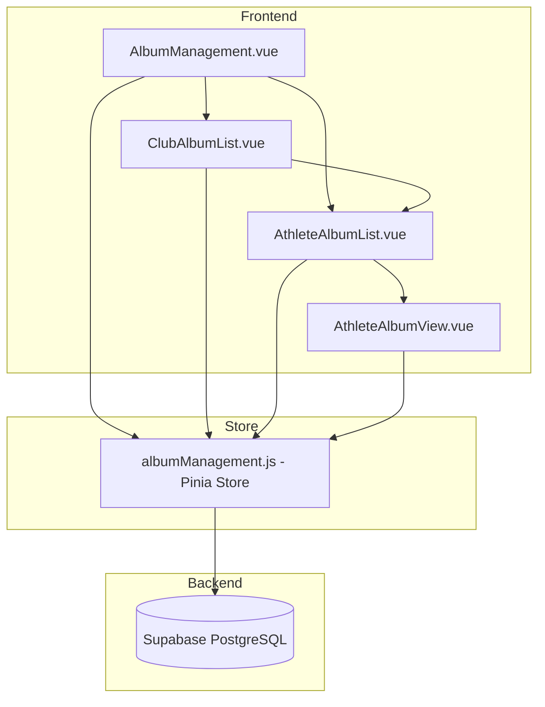

# Design Document: Album Individual View

## Overview

Album Individual View เป็นการปรับปรุงระบบอัลบั้มรูปภาพให้โค้ชและ Admin สามารถดูอัลบั้มแยกตามรายบุคคลได้ โดยโค้ชสามารถดูอัลบั้มของนักกีฬาแต่ละคนในชมรมแยกกัน และ Admin สามารถดูภาพรวมแต่ละชมรม รวมถึงดูอัลบั้มของแต่ละบุคคลได้

## Architecture



## Components and Interfaces

### Vue Components

#### 1. AlbumManagement.vue (หน้าหลัก)
- หน้าจัดการอัลบั้มสำหรับ Coach และ Admin
- แสดง UI ต่างกันตาม role:
  - **Coach**: แสดง AthleteAlbumList โดยตรง
  - **Admin**: แสดง ClubAlbumList ก่อน แล้วเลือกชมรม
- มี global search สำหรับ Admin
- มี search สำหรับ Coach

#### 2. ClubAlbumList.vue (Admin เท่านั้น)
- แสดงรายการชมรมทั้งหมด
- แสดงสถิติต่อชมรม: จำนวนอัลบั้ม, จำนวนไฟล์, พื้นที่ใช้งาน
- เรียงตามพื้นที่ใช้งานมากไปน้อย
- คลิกเลือกชมรมเพื่อดูนักกีฬา

#### 3. AthleteAlbumList.vue
- แสดงรายการนักกีฬาพร้อมสถิติอัลบั้ม
- สำหรับ Coach: แสดงนักกีฬาในชมรมตัวเอง
- สำหรับ Admin: แสดงนักกีฬาในชมรมที่เลือก
- เรียงตามชื่อ A-Z
- มี search filter
- แสดง: รูปโปรไฟล์, ชื่อ, จำนวนอัลบั้ม, จำนวนไฟล์, พื้นที่ใช้งาน

#### 4. AthleteAlbumView.vue
- แสดงอัลบั้มของนักกีฬาที่เลือก
- Header แสดงชื่อนักกีฬาและรูปโปรไฟล์
- สำหรับ Admin: แสดง breadcrumb (Clubs > Club Name > Athlete Name)
- ใช้ AlbumSection component ที่มีอยู่แล้ว (read-only mode)

### Store Functions (albumManagement.js)

```javascript
// สำหรับ Admin
fetchAllClubsWithStats()        // ดึงรายการชมรมพร้อมสถิติ
fetchAthletesByClub(clubId)     // ดึงนักกีฬาในชมรม
globalSearch(query)             // ค้นหาข้ามชมรมและนักกีฬา

// สำหรับ Coach
fetchAthletesInMyClub()         // ดึงนักกีฬาในชมรมของโค้ช

// Shared
fetchAthleteAlbums(userId)      // ดึงอัลบั้มของนักกีฬา
searchAthletes(query, clubId)   // ค้นหานักกีฬาในชมรม
getAthleteStats(userId)         // ดึงสถิติอัลบั้มของนักกีฬา
formatStorageSize(bytes)        // แปลงขนาดเป็น KB/MB
```

## Data Models

### Database Views/Queries

#### View: club_album_stats
```sql
-- สถิติอัลบั้มต่อชมรม (สำหรับ Admin)
SELECT 
  c.id as club_id,
  c.name as club_name,
  COUNT(DISTINCT ua.id) as total_albums,
  COUNT(DISTINCT am.id) as total_media,
  COALESCE(SUM(am.file_size), 0) as total_storage
FROM clubs c
LEFT JOIN user_profiles up ON up.club_id = c.id
LEFT JOIN user_albums ua ON ua.user_id = up.id
LEFT JOIN album_media am ON am.album_id = ua.id
GROUP BY c.id, c.name
ORDER BY total_storage DESC;
```

#### View: athlete_album_stats
```sql
-- สถิติอัลบั้มต่อนักกีฬา
SELECT 
  up.id as user_id,
  up.full_name,
  up.avatar_url,
  up.club_id,
  COUNT(DISTINCT ua.id) as album_count,
  COUNT(DISTINCT am.id) as media_count,
  COALESCE(SUM(am.file_size), 0) as storage_used
FROM user_profiles up
LEFT JOIN user_albums ua ON ua.user_id = up.id
LEFT JOIN album_media am ON am.album_id = ua.id
WHERE up.role = 'athlete'
GROUP BY up.id, up.full_name, up.avatar_url, up.club_id
ORDER BY up.full_name ASC;
```

### Role Matrix

| การกระทำ | Admin | Coach | Athlete |
|----------|-------|-------|---------|
| ดูรายการชมรมทั้งหมด | ✅ | ❌ | ❌ |
| ดูสถิติชมรม | ✅ | ❌ | ❌ |
| ดูรายการนักกีฬาทุกชมรม | ✅ | ❌ | ❌ |
| ดูรายการนักกีฬาในชมรมตัวเอง | ✅ | ✅ | ❌ |
| ดูอัลบั้มนักกีฬาทุกคน | ✅ | ❌ | ❌ |
| ดูอัลบั้มนักกีฬาในชมรม | ✅ | ✅ | ❌ |
| ค้นหาข้ามชมรม | ✅ | ❌ | ❌ |
| ค้นหาในชมรมตัวเอง | ✅ | ✅ | ❌ |

## Correctness Properties

*A property is a characteristic or behavior that should hold true across all valid executions of a system-essentially, a formal statement about what the system should do. Properties serve as the bridge between human-readable specifications and machine-verifiable correctness guarantees.*

### Property 1: Coach sees only athletes from their club
*For any* coach user, when fetching the athlete list, all returned athletes should have the same club_id as the coach's club_id.
**Validates: Requirements 1.1**

### Property 2: Athlete album filtering returns only that athlete's albums
*For any* athlete selection (by coach or admin), the returned albums should all have user_id matching the selected athlete's id.
**Validates: Requirements 1.2, 4.1**

### Property 3: Athlete list is sorted alphabetically by name
*For any* list of athletes returned (for coach or admin), the athletes should be sorted in ascending alphabetical order by full_name.
**Validates: Requirements 1.4**

### Property 4: Search filter returns only matching athletes
*For any* search query string, all returned athletes should have full_name containing the query string (case-insensitive). When search is empty, all athletes in scope should be returned.
**Validates: Requirements 2.2, 2.3**

### Property 5: Admin sees all clubs with accurate statistics
*For any* admin user, when fetching club list, all clubs should be returned and each club's statistics (total_albums, total_media, total_storage) should match the actual sum of data for that club.
**Validates: Requirements 3.1, 3.2**

### Property 6: Club list is sorted by storage used descending
*For any* list of clubs returned for admin, the clubs should be sorted in descending order by total_storage.
**Validates: Requirements 3.4**

### Property 7: Admin club selection returns only athletes from that club
*For any* club selection by admin, all returned athletes should have club_id matching the selected club's id.
**Validates: Requirements 3.3**

### Property 8: Admin view shows same albums as athlete view
*For any* athlete, the albums returned when admin views that athlete should be identical to the albums the athlete would see when viewing their own albums.
**Validates: Requirements 4.2**

### Property 9: Global search returns results from both clubs and athletes
*For any* global search query by admin, the results should include clubs with names matching the query AND athletes with names matching the query, grouped by club.
**Validates: Requirements 5.2, 5.3**

### Property 10: Athlete statistics are complete and accurate
*For any* athlete in the list, the displayed statistics (album_count, media_count, storage_used) should match the actual count and sum of their albums and media.
**Validates: Requirements 6.1, 6.2, 6.3**

### Property 11: Storage size formatting is correct
*For any* byte value, the formatStorageSize function should return a human-readable string with correct unit (B, KB, MB, GB) and value.
**Validates: Requirements 6.4**

## Error Handling

### Access Errors
- Coach accessing other club's data: แสดงข้อความ "คุณไม่มีสิทธิ์เข้าถึงข้อมูลนี้"
- Unauthorized access: Redirect to login

### Data Errors
- No athletes in club: แสดงข้อความ "ไม่พบนักกีฬาในชมรมนี้"
- No albums for athlete: แสดงข้อความ "นักกีฬาคนนี้ยังไม่มีอัลบั้ม"
- Search no results: แสดงข้อความ "ไม่พบผลลัพธ์ที่ตรงกับการค้นหา"

### Network Errors
- Failed to load data: แสดงข้อความ "เกิดข้อผิดพลาด กรุณาลองใหม่" พร้อมปุ่ม retry

## Testing Strategy

### Unit Tests
- formatStorageSize function
- Search filter logic
- Sorting functions

### Property-Based Tests
ใช้ **fast-check** library สำหรับ property-based testing

- Property 1: Coach club filtering
- Property 2: Athlete album filtering
- Property 3: Alphabetical sorting
- Property 4: Search filter
- Property 5: Club statistics accuracy
- Property 6: Club sorting by storage
- Property 7: Admin club selection filtering
- Property 8: Admin/athlete view consistency
- Property 9: Global search results
- Property 10: Athlete statistics accuracy
- Property 11: Storage size formatting

### Test Configuration
- Property tests should run minimum 100 iterations
- Each property test must be tagged with format: `**Feature: album-individual-view, Property {number}: {property_text}**`

