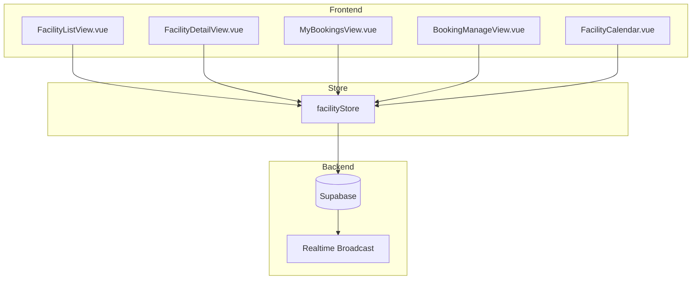

# Design Document: Facility Booking System

## Overview

ระบบขอใช้สถานที่ (Facility Booking) ช่วยให้นักกีฬาสามารถจองใช้สถานที่ฝึกซ้อมของสโมสรได้อย่างง่ายดาย โดยมีโค้ชเป็นผู้อนุมัติคำขอ และแอดมินจัดการสถานที่ ระบบออกแบบให้ใช้งานง่าย เข้าใจได้ใน 3 วินาที ด้วย UI ที่เรียบง่ายและสีบอกสถานะชัดเจน

### Key Features
- ดูรายการสถานที่พร้อมสถานะว่าง/เต็ม
- จองสถานที่แบบครั้งเดียวหรือจองซ้ำรายสัปดาห์
- ปฏิทินแสดงช่วงเวลาว่าง/จอง
- โค้ชอนุมัติ/ปฏิเสธคำขอ (บันทึกผู้อนุมัติ)
- แอดมินจัดการสถานที่

## Architecture



## Components and Interfaces

### Views

| Component | Path | Description | Roles |
|-----------|------|-------------|-------|
| FacilityListView | /facilities | รายการสถานที่ทั้งหมด | All |
| FacilityDetailView | /facilities/:id | รายละเอียดสถานที่ + ปฏิทิน + ฟอร์มจอง | All |
| MyBookingsView | /my-bookings | ประวัติการจองของฉัน | Athlete |
| BookingManageView | /booking-manage | จัดการคำขอจอง | Coach, Admin |
| FacilityManageView | /facility-manage | จัดการสถานที่ | Admin |

### Components

| Component | Description |
|-----------|-------------|
| FacilityCard | การ์ดแสดงสถานที่ พร้อม badge สถานะ |
| FacilityCalendar | ปฏิทินรายสัปดาห์แสดงช่วงเวลา |
| BookingForm | ฟอร์มจองสถานที่ |
| BookingCard | การ์ดแสดงข้อมูลการจอง |
| BookingStatusBadge | Badge แสดงสถานะการจอง |

### Store Interface

```typescript
interface FacilityStore {
  // State
  facilities: Facility[]
  bookings: Booking[]
  loading: boolean
  error: string | null
  
  // Getters
  activeFacilities: Facility[]
  myBookings: Booking[]
  pendingBookings: Booking[]
  
  // Actions
  fetchFacilities(): Promise<void>
  fetchFacilityById(id: string): Promise<Facility>
  createBooking(data: CreateBookingData): Promise<Result>
  createRecurringBooking(data: RecurringBookingData): Promise<Result>
  cancelBooking(id: string): Promise<Result>
  cancelRecurringSeries(seriesId: string): Promise<Result>
  approveBooking(id: string): Promise<Result>
  approveRecurringSeries(seriesId: string): Promise<Result>
  rejectBooking(id: string, reason: string): Promise<Result>
  
  // Admin Actions
  createFacility(data: FacilityData): Promise<Result>
  updateFacility(id: string, data: FacilityData): Promise<Result>
  deactivateFacility(id: string): Promise<Result>
}
```

## Data Models

### Database Schema

```sql
-- ตารางสถานที่
CREATE TABLE facilities (
  id UUID PRIMARY KEY DEFAULT gen_random_uuid(),
  club_id UUID REFERENCES clubs(id) ON DELETE CASCADE,
  name VARCHAR(100) NOT NULL,
  description TEXT,
  image_url TEXT,
  capacity INTEGER DEFAULT 1,
  is_active BOOLEAN DEFAULT true,
  created_at TIMESTAMPTZ DEFAULT NOW(),
  updated_at TIMESTAMPTZ DEFAULT NOW()
);

-- ตารางช่วงเวลาที่เปิดให้จอง
CREATE TABLE facility_time_slots (
  id UUID PRIMARY KEY DEFAULT gen_random_uuid(),
  facility_id UUID REFERENCES facilities(id) ON DELETE CASCADE,
  day_of_week INTEGER NOT NULL CHECK (day_of_week BETWEEN 0 AND 6),
  start_time TIME NOT NULL,
  end_time TIME NOT NULL,
  is_active BOOLEAN DEFAULT true,
  created_at TIMESTAMPTZ DEFAULT NOW()
);

-- ตารางการจอง
CREATE TABLE facility_bookings (
  id UUID PRIMARY KEY DEFAULT gen_random_uuid(),
  facility_id UUID REFERENCES facilities(id) ON DELETE CASCADE,
  athlete_id UUID REFERENCES user_profiles(id) ON DELETE CASCADE,
  booking_date DATE NOT NULL,
  start_time TIME NOT NULL,
  end_time TIME NOT NULL,
  status VARCHAR(20) DEFAULT 'pending' CHECK (status IN ('pending', 'approved', 'rejected', 'cancelled')),
  purpose TEXT,
  rejection_reason TEXT,
  series_id UUID, -- สำหรับ recurring booking
  approved_by UUID REFERENCES user_profiles(id),
  approved_at TIMESTAMPTZ,
  rejected_by UUID REFERENCES user_profiles(id),
  rejected_at TIMESTAMPTZ,
  created_at TIMESTAMPTZ DEFAULT NOW(),
  updated_at TIMESTAMPTZ DEFAULT NOW(),
  
  -- ป้องกันการจองซ้ำ
  CONSTRAINT unique_approved_booking UNIQUE (facility_id, booking_date, start_time, end_time) 
    WHERE status = 'approved'
);

-- Index สำหรับ query ที่ใช้บ่อย
CREATE INDEX idx_bookings_facility_date ON facility_bookings(facility_id, booking_date);
CREATE INDEX idx_bookings_athlete ON facility_bookings(athlete_id);
CREATE INDEX idx_bookings_status ON facility_bookings(status);
CREATE INDEX idx_bookings_series ON facility_bookings(series_id) WHERE series_id IS NOT NULL;
```

### TypeScript Interfaces

```typescript
interface Facility {
  id: string
  club_id: string
  name: string
  description: string
  image_url: string | null
  capacity: number
  is_active: boolean
  time_slots: TimeSlot[]
  created_at: string
  updated_at: string
}

interface TimeSlot {
  id: string
  facility_id: string
  day_of_week: number // 0=Sunday, 6=Saturday
  start_time: string // HH:mm
  end_time: string // HH:mm
  is_active: boolean
}

interface Booking {
  id: string
  facility_id: string
  athlete_id: string
  booking_date: string // YYYY-MM-DD
  start_time: string // HH:mm
  end_time: string // HH:mm
  status: 'pending' | 'approved' | 'rejected' | 'cancelled'
  purpose: string | null
  rejection_reason: string | null
  series_id: string | null
  approved_by: string | null
  approved_at: string | null
  rejected_by: string | null
  rejected_at: string | null
  created_at: string
  // Relations
  facility?: Facility
  athlete?: UserProfile
  approver?: UserProfile // Only visible to admin
}

interface CreateBookingData {
  facility_id: string
  booking_date: string
  start_time: string
  end_time: string
  purpose?: string
}

interface RecurringBookingData extends CreateBookingData {
  weeks: number // 2-8
}
```

## Role Matrix

| การกระทำ | Admin | Coach | Athlete |
|----------|-------|-------|---------|
| ดูสถานที่ทั้งหมด | ✅ | ✅ | ✅ |
| ดูปฏิทินสถานที่ | ✅ | ✅ | ✅ |
| สร้างคำขอจอง | ✅ | ✅ | ✅ |
| ดูการจองตัวเอง | ✅ | ✅ | ✅ |
| ยกเลิกการจองตัวเอง | ✅ | ✅ | ✅ |
| ดูคำขอจองในชมรม | ✅ | ✅ | ❌ |
| อนุมัติ/ปฏิเสธคำขอ | ✅ | ✅ | ❌ |
| ดูผู้อนุมัติ | ✅ | ❌ | ❌ |
| จัดการสถานที่ | ✅ | ❌ | ❌ |

## Correctness Properties

*A property is a characteristic or behavior that should hold true across all valid executions of a system-essentially, a formal statement about what the system should do. Properties serve as the bridge between human-readable specifications and machine-verifiable correctness guarantees.*

### Property 1: Available Slot Count Accuracy
*For any* facility and date, the available slot count SHALL equal total slots minus approved bookings for that date
**Validates: Requirements 1.3**

### Property 2: New Booking Status
*For any* newly created booking, the status SHALL always be "pending"
**Validates: Requirements 2.1**

### Property 3: No Double Booking
*For any* facility, date, and time slot, there SHALL be at most one approved booking
**Validates: Requirements 2.2, 4.4**

### Property 4: Booking Grouping Correctness
*For any* list of bookings, grouping by status SHALL produce mutually exclusive groups where each booking appears in exactly one group
**Validates: Requirements 3.1**

### Property 5: Pending Booking Cancellation
*For any* booking with status "pending", the athlete who created it SHALL be able to cancel it
**Validates: Requirements 3.3**

### Property 6: Club Filtering for Coach
*For any* coach viewing pending bookings, all displayed bookings SHALL belong to athletes in the same club
**Validates: Requirements 4.1**

### Property 7: Approval Metadata Recording
*For any* approved booking, the approver_id and approved_at fields SHALL be non-null
**Validates: Requirements 4.2**

### Property 8: Rejection Metadata Recording
*For any* rejected booking, the rejector_id, rejected_at, and rejection_reason fields SHALL be non-null
**Validates: Requirements 4.3**

### Property 9: Approver Visibility by Role
*For any* booking with approval metadata, the approver information SHALL be visible only to admin users
**Validates: Requirements 4.5, 4.6**

### Property 10: Facility Required Fields
*For any* facility, the name, description, capacity, and at least one time slot SHALL be present
**Validates: Requirements 5.1**

### Property 11: Deactivated Facility Booking Prevention
*For any* deactivated facility, new booking creation SHALL fail
**Validates: Requirements 5.3**

### Property 12: Calendar Slot Color Coding
*For any* time slot in calendar view, the color SHALL match its status (white=available, gray=booked, yellow=pending)
**Validates: Requirements 6.2, 6.3, 6.4**

### Property 13: Recurring Booking Week Range
*For any* recurring booking request, the weeks value SHALL be between 2 and 8 inclusive
**Validates: Requirements 7.2**

### Property 14: Recurring Booking Count
*For any* recurring booking with N weeks, exactly N individual bookings SHALL be created with the same series_id
**Validates: Requirements 7.3**

### Property 15: Recurring Series Approval
*For any* recurring series approval, all pending bookings in the series SHALL be approved
**Validates: Requirements 7.5**

## Error Handling

| Error Case | Handling |
|------------|----------|
| Time slot already booked | แสดง error "ช่วงเวลานี้ถูกจองแล้ว" และแนะนำช่วงเวลาว่าง |
| Facility deactivated | แสดง error "สถานที่นี้ปิดให้บริการชั่วคราว" |
| Invalid time range | แสดง error "เวลาเริ่มต้นต้องน้อยกว่าเวลาสิ้นสุด" |
| Past date booking | แสดง error "ไม่สามารถจองวันที่ผ่านมาแล้ว" |
| Recurring conflict | แสดง warning พร้อมรายการวันที่ขัดแย้ง ให้เลือกข้าม |
| Rejection without reason | แสดง error "กรุณาระบุเหตุผลในการปฏิเสธ" |

## Testing Strategy

### Unit Tests
- ทดสอบ slot availability calculation
- ทดสอบ booking grouping logic
- ทดสอบ recurring booking generation
- ทดสอบ role-based data filtering

### Property-Based Tests
ใช้ **fast-check** library สำหรับ property-based testing

- Property 1-15 ตามที่ระบุใน Correctness Properties
- ทดสอบด้วย arbitrary facilities, bookings, และ user roles
- ทดสอบ edge cases: empty slots, full capacity, overlapping times

### Integration Tests
- ทดสอบ booking flow end-to-end
- ทดสอบ approval/rejection flow
- ทดสอบ recurring booking series
- ทดสอบ RLS policies ด้วย 3 demo accounts

## UI/UX Design

### Color Coding (สถานะการจอง)
- **Available (ว่าง)**: White (#FFFFFF)
- **Pending (รออนุมัติ)**: Yellow (#F59E0B)
- **Approved (อนุมัติ)**: Green (#22C55E)
- **Rejected (ปฏิเสธ)**: Red (#EF4444)
- **Cancelled (ยกเลิก)**: Gray (#A3A3A3)

### Facility Card Design
```
┌─────────────────────────────────────┐
│ [Image]                             │
│                                     │
│ ┌─────┐  สนามฟุตบอล 1              │
│ │ 🏟️ │  ความจุ: 22 คน              │
│ └─────┘  ช่วงเวลาว่างวันนี้: 3 ช่อง  │
│                          [จอง →]    │
└─────────────────────────────────────┘
```

### Calendar View Design
```
┌──────────────────────────────────────────────────┐
│  < สัปดาห์ที่ 1-7 ธ.ค. 2567 >                    │
├──────┬──────┬──────┬──────┬──────┬──────┬──────┤
│ อา.  │ จ.   │ อ.   │ พ.   │ พฤ.  │ ศ.   │ ส.   │
├──────┼──────┼──────┼──────┼──────┼──────┼──────┤
│ 09:00│ ░░░░ │ ████ │      │ ░░░░ │      │ ████ │
│ 10:00│      │ ████ │ ░░░░ │      │ ████ │      │
│ 11:00│ ████ │      │      │ ████ │      │ ░░░░ │
└──────┴──────┴──────┴──────┴──────┴──────┴──────┘
  ░░░░ = รออนุมัติ (เหลือง)
  ████ = จองแล้ว (เทา)
       = ว่าง (ขาว)
```

