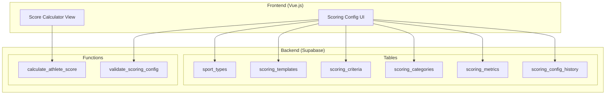

# Design Document: Flexible Scoring System

## Overview

ระบบเกณฑ์การให้คะแนนที่ยืดหยุ่น (Flexible Scoring System) ออกแบบมาเพื่อให้ชมรมกีฬาสามารถกำหนดเกณฑ์การประเมินนักกีฬาได้ตามความต้องการ โดยมี Template สำเร็จรูปสำหรับกีฬายอดนิยม และรองรับการปรับแต่งเต็มรูปแบบ

### Key Design Goals

1. **Flexibility** - รองรับทุกประเภทกีฬาด้วยระบบ Template + Custom
2. **Consistency** - คำนวณคะแนนอย่างสม่ำเสมอตามเกณฑ์ที่กำหนด
3. **Traceability** - เก็บประวัติการเปลี่ยนแปลงเกณฑ์ทั้งหมด
4. **Usability** - ใช้งานง่ายด้วย UI ที่เข้าใจได้

## Architecture



## Components and Interfaces

### 1. Sport Type Registry

จัดการประเภทกีฬาและรูปแบบการแข่งขัน

```typescript
interface SportType {
  id: string;
  name: string;                    // เช่น "pencak_silat", "futsal"
  display_name: string;            // เช่น "ปันจักสีลัต", "ฟุตซอล"
  description: string;
  competition_formats: CompetitionFormat[];
  is_system: boolean;              // true = ระบบสร้าง, false = user สร้าง
  created_at: timestamp;
}

interface CompetitionFormat {
  id: string;
  sport_type_id: string;
  name: string;                    // เช่น "sparring", "kata", "team_match"
  display_name: string;            // เช่น "ต่อสู้คะแนน", "รำโชว์"
  team_size: number | null;        // null = individual
  description: string;
}
```

### 2. Scoring Template System

Template สำเร็จรูปสำหรับแต่ละประเภทกีฬา

```typescript
interface ScoringTemplate {
  id: string;
  sport_type_id: string;
  name: string;
  description: string;
  categories: TemplateCategory[];
  is_default: boolean;
  created_at: timestamp;
}

interface TemplateCategory {
  id: string;
  template_id: string;
  name: string;                    // เช่น "attendance", "training", "skill"
  display_name: string;            // เช่น "การเข้าร่วม", "การฝึกซ้อม"
  weight: number;                  // 0-100, รวมทุก category = 100
  metrics: TemplateMetric[];
  sort_order: number;
}

interface TemplateMetric {
  id: string;
  category_id: string;
  name: string;                    // เช่น "attendance_rate", "technique_score"
  display_name: string;
  measurement_type: 'count' | 'percentage' | 'rating' | 'time' | 'distance';
  target_value: number | null;
  rating_scale_min: number;
  rating_scale_max: number;
  formula: string | null;          // สูตรคำนวณ (ถ้ามี)
  is_required: boolean;
}
```

### 3. Club Scoring Configuration

การตั้งค่าเกณฑ์เฉพาะของแต่ละชมรม

```typescript
interface ClubScoringConfig {
  id: string;
  club_id: string;
  sport_type_id: string;
  template_id: string | null;      // null = custom from scratch
  name: string;
  is_active: boolean;
  version: number;
  categories: ScoringCategory[];
  tier_thresholds: TierThreshold[];
  created_by: string;
  created_at: timestamp;
  updated_at: timestamp;
}

interface ScoringCategory {
  id: string;
  config_id: string;
  name: string;
  display_name: string;
  category_type: 'attendance' | 'training' | 'skill' | 'competition' | 'custom';
  weight: number;                  // 0-100
  metrics: ScoringMetric[];
  is_active: boolean;
  sort_order: number;
}

interface ScoringMetric {
  id: string;
  category_id: string;
  name: string;
  display_name: string;
  description: string;
  measurement_type: 'count' | 'percentage' | 'rating' | 'time' | 'distance';
  target_value: number | null;
  min_value: number;
  max_value: number;
  default_value: number;
  scoring_formula: string;         // เช่น "(actual / target) * 100"
  is_required: boolean;
  is_active: boolean;
}

interface TierThreshold {
  tier: 'excellent' | 'good' | 'average' | 'needs_improvement';
  min_score: number;
  display_name: string;
  color: string;
}
```

### 4. Score Calculation Engine

```typescript
interface ScoreCalculationInput {
  athlete_id: string;
  config_id: string;
  period_start: Date;
  period_end: Date;
  metric_values: MetricValue[];
}

interface MetricValue {
  metric_id: string;
  actual_value: number;
}

interface ScoreCalculationResult {
  overall_score: number;           // 0-100
  performance_tier: string;
  category_scores: CategoryScore[];
  calculation_details: CalculationDetail[];
}

interface CategoryScore {
  category_id: string;
  category_name: string;
  raw_score: number;               // คะแนนดิบ
  weighted_score: number;          // คะแนนหลังคูณน้ำหนัก
  weight: number;
}

interface CalculationDetail {
  metric_id: string;
  metric_name: string;
  actual_value: number;
  target_value: number;
  score: number;
  formula_used: string;
}
```

### 5. Configuration History

```typescript
interface ConfigHistory {
  id: string;
  config_id: string;
  version: number;
  snapshot: JSON;                  // Full config snapshot
  change_summary: string;
  changed_by: string;
  changed_at: timestamp;
}
```

## Data Models

### Database Schema

```sql
-- ประเภทกีฬา
CREATE TABLE sport_types (
  id UUID PRIMARY KEY DEFAULT gen_random_uuid(),
  name TEXT NOT NULL UNIQUE,
  display_name TEXT NOT NULL,
  description TEXT,
  is_system BOOLEAN DEFAULT false,
  created_at TIMESTAMPTZ DEFAULT now()
);

-- รูปแบบการแข่งขัน
CREATE TABLE competition_formats (
  id UUID PRIMARY KEY DEFAULT gen_random_uuid(),
  sport_type_id UUID REFERENCES sport_types(id),
  name TEXT NOT NULL,
  display_name TEXT NOT NULL,
  team_size INTEGER,
  description TEXT,
  UNIQUE(sport_type_id, name)
);

-- Template สำเร็จรูป
CREATE TABLE scoring_templates (
  id UUID PRIMARY KEY DEFAULT gen_random_uuid(),
  sport_type_id UUID REFERENCES sport_types(id),
  name TEXT NOT NULL,
  description TEXT,
  is_default BOOLEAN DEFAULT false,
  created_at TIMESTAMPTZ DEFAULT now()
);

-- หมวดหมู่ใน Template
CREATE TABLE template_categories (
  id UUID PRIMARY KEY DEFAULT gen_random_uuid(),
  template_id UUID REFERENCES scoring_templates(id) ON DELETE CASCADE,
  name TEXT NOT NULL,
  display_name TEXT NOT NULL,
  category_type TEXT NOT NULL CHECK (category_type IN ('attendance', 'training', 'skill', 'competition', 'custom')),
  weight INTEGER NOT NULL CHECK (weight >= 0 AND weight <= 100),
  sort_order INTEGER DEFAULT 0
);

-- Metrics ใน Template
CREATE TABLE template_metrics (
  id UUID PRIMARY KEY DEFAULT gen_random_uuid(),
  category_id UUID REFERENCES template_categories(id) ON DELETE CASCADE,
  name TEXT NOT NULL,
  display_name TEXT NOT NULL,
  measurement_type TEXT NOT NULL CHECK (measurement_type IN ('count', 'percentage', 'rating', 'time', 'distance')),
  target_value NUMERIC,
  rating_scale_min INTEGER DEFAULT 1,
  rating_scale_max INTEGER DEFAULT 5,
  formula TEXT,
  is_required BOOLEAN DEFAULT true
);

-- การตั้งค่าเกณฑ์ของชมรม
CREATE TABLE club_scoring_configs (
  id UUID PRIMARY KEY DEFAULT gen_random_uuid(),
  club_id UUID REFERENCES clubs(id),
  sport_type_id UUID REFERENCES sport_types(id),
  template_id UUID REFERENCES scoring_templates(id),
  name TEXT NOT NULL,
  is_active BOOLEAN DEFAULT false,
  version INTEGER DEFAULT 1,
  tier_excellent_min INTEGER DEFAULT 85,
  tier_good_min INTEGER DEFAULT 70,
  tier_average_min INTEGER DEFAULT 50,
  created_by UUID REFERENCES auth.users(id),
  created_at TIMESTAMPTZ DEFAULT now(),
  updated_at TIMESTAMPTZ DEFAULT now(),
  UNIQUE(club_id, name)
);

-- หมวดหมู่ของชมรม
CREATE TABLE club_scoring_categories (
  id UUID PRIMARY KEY DEFAULT gen_random_uuid(),
  config_id UUID REFERENCES club_scoring_configs(id) ON DELETE CASCADE,
  name TEXT NOT NULL,
  display_name TEXT NOT NULL,
  category_type TEXT NOT NULL CHECK (category_type IN ('attendance', 'training', 'skill', 'competition', 'custom')),
  weight INTEGER NOT NULL CHECK (weight >= 0 AND weight <= 100),
  is_active BOOLEAN DEFAULT true,
  sort_order INTEGER DEFAULT 0
);

-- Metrics ของชมรม
CREATE TABLE club_scoring_metrics (
  id UUID PRIMARY KEY DEFAULT gen_random_uuid(),
  category_id UUID REFERENCES club_scoring_categories(id) ON DELETE CASCADE,
  name TEXT NOT NULL,
  display_name TEXT NOT NULL,
  description TEXT,
  measurement_type TEXT NOT NULL CHECK (measurement_type IN ('count', 'percentage', 'rating', 'time', 'distance')),
  target_value NUMERIC,
  min_value NUMERIC DEFAULT 0,
  max_value NUMERIC DEFAULT 100,
  default_value NUMERIC DEFAULT 0,
  scoring_formula TEXT DEFAULT '(actual / target) * 100',
  is_required BOOLEAN DEFAULT true,
  is_active BOOLEAN DEFAULT true
);

-- ประวัติการเปลี่ยนแปลง
CREATE TABLE scoring_config_history (
  id UUID PRIMARY KEY DEFAULT gen_random_uuid(),
  config_id UUID REFERENCES club_scoring_configs(id) ON DELETE CASCADE,
  version INTEGER NOT NULL,
  snapshot JSONB NOT NULL,
  change_summary TEXT,
  changed_by UUID REFERENCES auth.users(id),
  changed_at TIMESTAMPTZ DEFAULT now()
);
```

### Default Sport Types Data

```sql
-- ประเภทกีฬาเริ่มต้น
INSERT INTO sport_types (name, display_name, description, is_system) VALUES
('pencak_silat', 'ปันจักสีลัต', 'ศิลปะการป้องกันตัวของเอเชียตะวันออกเฉียงใต้', true),
('futsal', 'ฟุตซอล', 'ฟุตบอลขนาดย่อม 5 คน สนามในร่ม', true),
('football', 'ฟุตบอล', 'ฟุตบอล 11 คน สนามกลางแจ้ง', true),
('sepak_takraw', 'ตะกร้อ', 'กีฬาเตะลูกตะกร้อข้ามตาข่าย', true),
('custom', 'กำหนดเอง', 'กำหนดประเภทกีฬาและเกณฑ์เอง', true);

-- รูปแบบการแข่งขัน
INSERT INTO competition_formats (sport_type_id, name, display_name, team_size) VALUES
-- ปันจักสีลัต
((SELECT id FROM sport_types WHERE name = 'pencak_silat'), 'sparring', 'ต่อสู้คะแนน', 1),
((SELECT id FROM sport_types WHERE name = 'pencak_silat'), 'kata', 'รำโชว์ (ร่ายท่า)', 1),
-- ฟุตซอล
((SELECT id FROM sport_types WHERE name = 'futsal'), 'team_match', 'แข่งขันทีม', 5),
-- ฟุตบอล
((SELECT id FROM sport_types WHERE name = 'football'), 'team_match', 'แข่งขันทีม', 11),
-- ตะกร้อ
((SELECT id FROM sport_types WHERE name = 'sepak_takraw'), 'regu', 'เซปักตะกร้อทีม', 3),
((SELECT id FROM sport_types WHERE name = 'sepak_takraw'), 'circle', 'วงโตก', NULL);
```

## Correctness Properties

*A property is a characteristic or behavior that should hold true across all valid executions of a system-essentially, a formal statement about what the system should do. Properties serve as the bridge between human-readable specifications and machine-verifiable correctness guarantees.*

### Property 1: Weight Sum Invariant
*For any* scoring configuration (template or club-specific), the sum of all category weights SHALL equal exactly 100 percent.
**Validates: Requirements 2.3, 7.1**

### Property 2: Weight Redistribution Consistency
*For any* scoring configuration, when a category is added or removed, the total weight SHALL remain exactly 100 percent after automatic redistribution.
**Validates: Requirements 3.2, 3.3**

### Property 3: Sport Type Template Mapping
*For any* sport type selection, the system SHALL return a valid scoring template containing at least the common metrics (attendance_rate, training_hours, coach_rating).
**Validates: Requirements 1.2, 5.4**

### Property 4: Score Calculation Correctness
*For any* set of metric values and category weights, the overall score SHALL equal the sum of (category_score × category_weight / 100) for all categories.
**Validates: Requirements 6.1**

### Property 5: Score Capping Behavior
*For any* metric value that exceeds its target, the resulting category score SHALL be capped at 100 unless bonus configuration is enabled.
**Validates: Requirements 6.2**

### Property 6: Missing Data Handling
*For any* score calculation with missing metric values, the system SHALL use the configured default value (or zero) and produce a valid numeric result.
**Validates: Requirements 6.3**

### Property 7: Tier Assignment Correctness
*For any* calculated overall score, the assigned performance tier SHALL match the configured threshold ranges (excellent >= 85, good >= 70, average >= 50, needs_improvement < 50 by default).
**Validates: Requirements 6.4**

### Property 8: Configuration Isolation
*For any* club-specific configuration modification, the original system template SHALL remain unchanged.
**Validates: Requirements 2.4**

### Property 9: Version History Integrity
*For any* configuration change or restoration, a new version entry SHALL be created preserving the complete history chain.
**Validates: Requirements 8.1, 8.4**

### Property 10: Category Validation
*For any* scoring category, if it has no active metrics defined, the system SHALL prevent activation and return a validation error.
**Validates: Requirements 7.2**

## Error Handling

### Validation Errors

| Error Code | Condition | Message |
|------------|-----------|---------|
| WEIGHT_SUM_INVALID | Total weight ≠ 100 | "น้ำหนักรวมต้องเท่ากับ 100% (ปัจจุบัน: {sum}%)" |
| CATEGORY_NO_METRICS | Category has no metrics | "หมวดหมู่ '{name}' ต้องมีอย่างน้อย 1 ตัวชี้วัด" |
| METRIC_INVALID_THRESHOLD | Invalid min/max values | "ค่าต่ำสุดต้องน้อยกว่าค่าสูงสุด" |
| CONFIG_NOT_FOUND | Config ID not found | "ไม่พบการตั้งค่าเกณฑ์ที่ระบุ" |
| TEMPLATE_NOT_FOUND | Template ID not found | "ไม่พบ Template ที่ระบุ" |

### Calculation Errors

| Error Code | Condition | Message |
|------------|-----------|---------|
| CALC_NO_CONFIG | No active config for club | "ชมรมยังไม่มีเกณฑ์การให้คะแนนที่ใช้งาน" |
| CALC_MISSING_REQUIRED | Required metric missing | "ขาดข้อมูลตัวชี้วัดที่จำเป็น: {metric_name}" |
| CALC_INVALID_VALUE | Value out of range | "ค่า {metric_name} อยู่นอกช่วงที่กำหนด" |

## Testing Strategy

### Dual Testing Approach

ใช้ทั้ง Unit Tests และ Property-Based Tests เพื่อความครอบคลุม:

1. **Unit Tests** - ทดสอบ specific examples และ edge cases
2. **Property-Based Tests** - ทดสอบ universal properties ด้วย random inputs

### Property-Based Testing Library

ใช้ **fast-check** สำหรับ TypeScript/JavaScript property-based testing

```bash
npm install --save-dev fast-check
```

### Test Configuration

- Minimum iterations per property: 100
- Each property test must reference the correctness property from design document

### Test Categories

1. **Weight Validation Tests**
   - Property 1: Weight sum invariant
   - Property 2: Weight redistribution

2. **Template Tests**
   - Property 3: Sport type template mapping
   - Property 8: Configuration isolation

3. **Calculation Tests**
   - Property 4: Score calculation correctness
   - Property 5: Score capping
   - Property 6: Missing data handling
   - Property 7: Tier assignment

4. **History Tests**
   - Property 9: Version history integrity

5. **Validation Tests**
   - Property 10: Category validation
