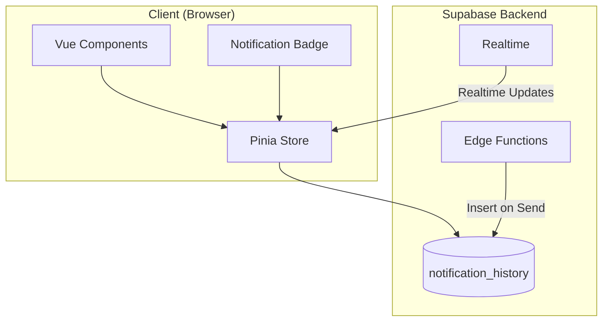

# Design Document: Notification Inbox

## Overview

ระบบ Notification Inbox สำหรับแอปจัดการสโมสรกีฬา เก็บประวัติการแจ้งเตือนทั้งหมดที่ส่งไปยังผู้ใช้ รองรับการดูย้อนหลัง จัดการสถานะอ่าน/ยังไม่อ่าน กรองตามประเภท และลบการแจ้งเตือน ทำงานร่วมกับระบบ PWA Push Notifications ที่มีอยู่

## Architecture



### Data Flow

1. **Store Flow**: Push notification sent → Edge Function inserts to notification_history → Realtime updates client
2. **Read Flow**: User opens notification → Update read_at timestamp → Decrement unread count
3. **Delete Flow**: User deletes notification → Remove from database → Update UI and badge count

## Components and Interfaces

### 1. Notification Inbox Store (`src/stores/notificationInbox.js`)

```javascript
// Pinia store for managing notification inbox
state: {
  notifications: NotificationHistoryItem[],
  unreadCount: number,
  loading: boolean,
  hasMore: boolean,
  currentFilter: string | null
}

actions: {
  fetchNotifications(userId: string, page: number, filter?: string): Promise<void>
  markAsRead(notificationId: string): Promise<void>
  markAsUnread(notificationId: string): Promise<void>
  markAllAsRead(userId: string): Promise<void>
  deleteNotification(notificationId: string): Promise<void>
  deleteMultiple(notificationIds: string[]): Promise<void>
  clearAll(userId: string): Promise<void>
  fetchUnreadCount(userId: string): Promise<number>
  subscribeToRealtime(userId: string): void
}

getters: {
  sortedNotifications: NotificationHistoryItem[]
  filteredNotifications: NotificationHistoryItem[]
}
```

### 2. Notification Inbox View (`src/views/NotificationInbox.vue`)

- Display list of notifications with infinite scroll
- Filter tabs by notification type
- Bulk actions (mark all read, clear all)
- Individual notification actions (mark read/unread, delete)

### 3. Notification Badge Component (`src/components/NotificationBadge.vue`)

- Display unread count on navigation icon
- Hide when count is zero
- Realtime updates via Supabase subscription

### 4. Notification Item Component (`src/components/NotificationItem.vue`)

- Display single notification with title, message, type icon, timestamp
- Visual distinction for read/unread status
- Click to navigate or show details
- Swipe to delete (mobile)

### 5. Edge Function Update (`supabase/functions/send-push/index.ts`)

```typescript
// Add notification history insertion
async function insertNotificationHistory(
  userId: string,
  title: string,
  message: string,
  type: string,
  referenceType?: string,
  referenceId?: string
): Promise<void>
```

## Data Models

### 1. notification_history Table

```sql
CREATE TABLE notification_history (
  id UUID PRIMARY KEY DEFAULT gen_random_uuid(),
  user_id UUID REFERENCES auth.users(id) ON DELETE CASCADE,
  title TEXT NOT NULL,
  message TEXT NOT NULL,
  type TEXT NOT NULL,
  reference_type TEXT,
  reference_id UUID,
  read_at TIMESTAMPTZ,
  created_at TIMESTAMPTZ DEFAULT now(),
  
  CONSTRAINT valid_type CHECK (type IN ('announcement_urgent', 'announcement_normal', 'schedule_updates', 'event_reminders', 'tournament_updates', 'club_application'))
);

CREATE INDEX idx_notification_history_user_id ON notification_history(user_id);
CREATE INDEX idx_notification_history_created_at ON notification_history(created_at DESC);
CREATE INDEX idx_notification_history_read_at ON notification_history(read_at) WHERE read_at IS NULL;
```

### 2. NotificationHistoryItem Interface

```typescript
interface NotificationHistoryItem {
  id: string
  user_id: string
  title: string
  message: string
  type: NotificationType
  reference_type: string | null
  reference_id: string | null
  read_at: string | null
  created_at: string
}

type NotificationType = 
  | 'announcement_urgent'
  | 'announcement_normal'
  | 'schedule_updates'
  | 'event_reminders'
  | 'tournament_updates'
  | 'club_application'
```

### 3. Pagination Interface

```typescript
interface PaginationParams {
  page: number
  pageSize: number
  filter?: NotificationType
}

interface PaginatedResult<T> {
  data: T[]
  hasMore: boolean
  total: number
}
```

## Correctness Properties

*A property is a characteristic or behavior that should hold true across all valid executions of a system-essentially, a formal statement about what the system should do. Properties serve as the bridge between human-readable specifications and machine-verifiable correctness guarantees.*

### Property 1: Notification storage round-trip
*For any* valid notification data (title, message, type, reference), storing it in the notification_history table and then retrieving it should return equivalent notification data.
**Validates: Requirements 1.2**

### Property 2: Notifications sorted by date descending
*For any* list of notifications returned from the inbox, each notification's created_at timestamp should be greater than or equal to the next notification's timestamp.
**Validates: Requirements 1.1**

### Property 3: Pagination returns correct subsets
*For any* page number N and page size S, the returned notifications should be exactly the items from index (N-1)*S to N*S-1 of the full sorted list, and hasMore should be true if more items exist.
**Validates: Requirements 1.4**

### Property 4: Read status persistence round-trip
*For any* notification, marking it as read and then fetching it should return read_at as non-null; marking it as unread and fetching should return read_at as null.
**Validates: Requirements 2.1, 2.2, 2.4**

### Property 5: Mark all as read updates all notifications
*For any* set of notifications belonging to a user, after calling markAllAsRead, all notifications should have read_at as non-null.
**Validates: Requirements 2.3**

### Property 6: Unread count consistency
*For any* set of notifications, the unread count should equal the number of notifications where read_at is null. After marking one as read, the count should decrease by 1. After adding a new notification, the count should increase by 1.
**Validates: Requirements 3.1, 3.3, 3.4, 4.4**

### Property 7: Delete removes notification
*For any* notification that is deleted, attempting to fetch it should return null or not found. For bulk delete, all selected notifications should be removed. For clear all, the user's notification list should be empty.
**Validates: Requirements 4.1, 4.2, 4.3**

### Property 8: Filter returns only matching type
*For any* notification type filter, all returned notifications should have a type matching the filter. When filter is "all" or null, all notifications should be returned.
**Validates: Requirements 5.1, 5.2**

### Property 9: Navigation URL generation
*For any* notification with reference_type and reference_id, the generated navigation URL should follow the pattern: /{reference_type}/{reference_id} or the appropriate route for that content type.
**Validates: Requirements 6.1**

## Error Handling

### Database Errors
- Retry failed operations with exponential backoff (max 3 attempts)
- Show user-friendly error message
- Log errors for debugging

### Realtime Connection Lost
- Attempt reconnection automatically
- Show offline indicator
- Queue read status changes for sync when reconnected

### Content Not Found
- Display "Content no longer available" message
- Allow user to delete the notification
- Do not navigate to broken links

### Permission Denied
- RLS will prevent access to other users' notifications
- Show appropriate error message if somehow attempted

## Testing Strategy

### Property-Based Testing Library
**fast-check** จะถูกใช้สำหรับ property-based testing ใน JavaScript/TypeScript

### Unit Tests
- Test notification CRUD operations
- Test pagination logic
- Test filter logic
- Test URL generation for navigation
- Test unread count calculations

### Property-Based Tests
Each correctness property will be implemented as a property-based test using fast-check:

1. **Property 1 Test**: Generate random notification data, store and retrieve, verify equality
2. **Property 2 Test**: Generate random notifications with various timestamps, verify sort order
3. **Property 3 Test**: Generate random page/size combinations, verify correct subset returned
4. **Property 4 Test**: Generate random notifications, toggle read status, verify persistence
5. **Property 6 Test**: Generate random notification sets, perform operations, verify count consistency
6. **Property 7 Test**: Generate random notifications, delete operations, verify removal
7. **Property 8 Test**: Generate random notifications with various types, apply filters, verify results
8. **Property 9 Test**: Generate random reference types and IDs, verify URL generation

### Test Configuration
- Minimum 100 iterations per property test
- Each test tagged with: `**Feature: notification-inbox, Property {number}: {property_text}**`

### Integration Tests
- Test full flow: receive notification → view in inbox → mark as read → delete
- Test realtime updates when new notification arrives
- Test pagination with large datasets
- Test filter combinations

