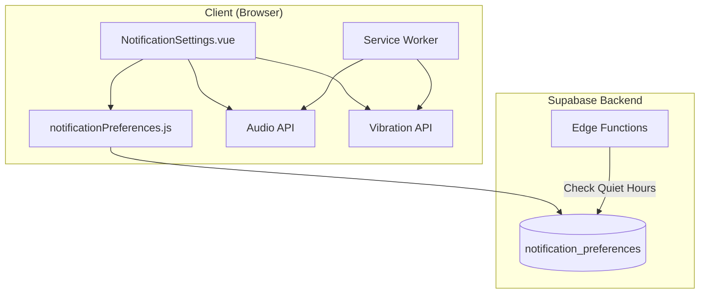

# Design Document: Notification Settings Enhancement

## Overview

ระบบปรับปรุงการตั้งค่าการแจ้งเตือน เพิ่มความสามารถในการตั้งเวลาไม่รบกวน (Quiet Hours) เลือกเสียงแจ้งเตือน ตั้งค่าการสั่น และทดสอบการแจ้งเตือน ทำงานร่วมกับระบบ PWA Push Notifications และ Notification Inbox ที่มีอยู่

## Architecture



### Data Flow

1. **Settings Flow**: User changes setting → Store updates database → UI reflects change
2. **Quiet Hours Flow**: Notification triggered → Edge Function checks quiet hours → Suppress or deliver
3. **Test Flow**: User clicks test → Send test notification → Service Worker displays with sound/vibration

## Components and Interfaces

### 1. Updated Notification Preferences Store (`src/stores/notificationPreferences.js`)

```javascript
// เพิ่ม state ใหม่
state: {
  // ... existing state
  quietHoursEnabled: boolean,
  quietHoursStart: string,  // "HH:mm" format
  quietHoursEnd: string,    // "HH:mm" format
  notificationSound: string, // 'default', 'chime', 'bell', 'none'
  vibrationEnabled: boolean,
  vibrationPattern: string   // 'short', 'medium', 'long', 'pulse'
}

// เพิ่ม actions ใหม่
actions: {
  updateQuietHours(enabled: boolean, start?: string, end?: string): Promise<void>
  updateNotificationSound(sound: string): Promise<void>
  updateVibrationSettings(enabled: boolean, pattern?: string): Promise<void>
  sendTestNotification(): Promise<{success: boolean, error?: string}>
  testVibration(): void
  isWithinQuietHours(time?: Date): boolean
}
```

### 2. Updated NotificationSettings Component (`src/components/NotificationSettings.vue`)

เพิ่ม sections ใหม่:
- Quiet Hours section with time pickers
- Sound Settings section with sound selector and preview
- Vibration Settings section with pattern selector and test button
- Test Notification button

### 3. Sound Assets (`public/sounds/`)

```
public/sounds/
├── default.mp3
├── chime.mp3
├── bell.mp3
└── soft.mp3
```

### 4. Updated Service Worker (`public/sw-push.js`)

```javascript
// เพิ่มการจัดการ sound และ vibration
self.addEventListener('push', async (event) => {
  const data = event.data.json()
  const preferences = await getPreferences(data.userId)
  
  // Check quiet hours
  if (isWithinQuietHours(preferences)) {
    return // Suppress notification
  }
  
  // Play sound
  if (preferences.notificationSound !== 'none') {
    playSound(preferences.notificationSound)
  }
  
  // Trigger vibration
  if (preferences.vibrationEnabled) {
    triggerVibration(preferences.vibrationPattern)
  }
  
  // Show notification
  self.registration.showNotification(data.title, options)
})
```

## Data Models

### 1. Updated notification_preferences Table

```sql
-- เพิ่ม columns ใหม่
ALTER TABLE notification_preferences
ADD COLUMN quiet_hours_enabled BOOLEAN DEFAULT false,
ADD COLUMN quiet_hours_start TIME DEFAULT '22:00',
ADD COLUMN quiet_hours_end TIME DEFAULT '07:00',
ADD COLUMN notification_sound TEXT DEFAULT 'default',
ADD COLUMN vibration_enabled BOOLEAN DEFAULT true,
ADD COLUMN vibration_pattern TEXT DEFAULT 'short';

-- Add constraints
ALTER TABLE notification_preferences
ADD CONSTRAINT valid_sound CHECK (notification_sound IN ('default', 'chime', 'bell', 'soft', 'none')),
ADD CONSTRAINT valid_vibration_pattern CHECK (vibration_pattern IN ('short', 'medium', 'long', 'pulse'));
```

### 2. Updated NotificationPreferences Interface

```typescript
interface NotificationPreferences {
  id: string
  user_id: string
  push_enabled: boolean
  // ... existing fields
  
  // New fields
  quiet_hours_enabled: boolean
  quiet_hours_start: string  // "HH:mm"
  quiet_hours_end: string    // "HH:mm"
  notification_sound: 'default' | 'chime' | 'bell' | 'soft' | 'none'
  vibration_enabled: boolean
  vibration_pattern: 'short' | 'medium' | 'long' | 'pulse'
}
```

### 3. Vibration Patterns

```typescript
const VIBRATION_PATTERNS = {
  short: [100],           // 100ms vibration
  medium: [200, 100, 200], // vibrate-pause-vibrate
  long: [500],            // 500ms vibration
  pulse: [100, 50, 100, 50, 100] // rapid pulses
}
```

### 4. Sound Options

```typescript
const SOUND_OPTIONS = [
  { key: 'default', label: 'เสียงเริ่มต้น', file: '/sounds/default.mp3' },
  { key: 'chime', label: 'เสียงระฆัง', file: '/sounds/chime.mp3' },
  { key: 'bell', label: 'เสียงกระดิ่ง', file: '/sounds/bell.mp3' },
  { key: 'soft', label: 'เสียงนุ่มนวล', file: '/sounds/soft.mp3' },
  { key: 'none', label: 'ไม่มีเสียง', file: null }
]
```

## Correctness Properties

*A property is a characteristic or behavior that should hold true across all valid executions of a system-essentially, a formal statement about what the system should do. Properties serve as the bridge between human-readable specifications and machine-verifiable correctness guarantees.*

### Property 1: Quiet Hours time filtering
*For any* notification time and quiet hours configuration, if quiet_hours_enabled is true and the time falls within the range (start to end, handling midnight crossing), the notification should be suppressed. If quiet_hours_enabled is false or time is outside the range, the notification should be delivered.
**Validates: Requirements 1.3, 1.4, 1.5**

### Property 2: Preferences persistence round-trip
*For any* valid preference values (quiet_hours, sound, vibration), storing them in the database and then retrieving them should return equivalent values.
**Validates: Requirements 1.2, 2.3, 4.3, 5.1**

### Property 3: Preferences loading completeness
*For any* user with saved preferences, loading preferences should return all fields including quiet_hours_enabled, quiet_hours_start, quiet_hours_end, notification_sound, vibration_enabled, and vibration_pattern with their saved values.
**Validates: Requirements 5.2, 5.4**

### Property 4: Vibration pattern validity
*For any* vibration pattern selection, the pattern should be one of the valid options ('short', 'medium', 'long', 'pulse') and the corresponding vibration array should be non-empty.
**Validates: Requirements 4.2, 4.3**

### Property 5: Sound selection validity
*For any* sound selection, the sound should be one of the valid options ('default', 'chime', 'bell', 'soft', 'none') and if not 'none', should have a corresponding audio file path.
**Validates: Requirements 2.1, 2.3**

## Error Handling

### Database Errors
- Retry failed operations with exponential backoff (max 3 attempts)
- Show user-friendly error message in Thai
- Revert UI state if update fails

### Audio/Vibration API Errors
- Check browser support before using APIs
- Gracefully degrade if not supported
- Show warning message if feature unavailable

### Test Notification Errors
- Check online status before sending
- Show specific error message for different failure types
- Provide troubleshooting suggestions

## Testing Strategy

### Property-Based Testing Library
**fast-check** จะถูกใช้สำหรับ property-based testing ใน JavaScript/TypeScript

### Unit Tests
- Test quiet hours time calculation (including midnight crossing)
- Test preference CRUD operations
- Test vibration pattern mapping
- Test sound file path resolution

### Property-Based Tests
Each correctness property will be implemented as a property-based test using fast-check:

1. **Property 1 Test**: Generate random times and quiet hours configurations, verify filtering logic
2. **Property 2 Test**: Generate random preference values, store and retrieve, verify equality
3. **Property 3 Test**: Generate random complete preferences, save and load, verify all fields present
4. **Property 4 Test**: Generate random vibration patterns, verify validity and array mapping
5. **Property 5 Test**: Generate random sound selections, verify validity and file path

### Test Configuration
- Minimum 100 iterations per property test
- Each test tagged with: `**Feature: notification-settings-enhancement, Property {number}: {property_text}**`

### Integration Tests
- Test full flow: change setting → verify database → reload page → verify setting persisted
- Test quiet hours with actual notification sending
- Test sound preview playback
- Test vibration on supported devices
