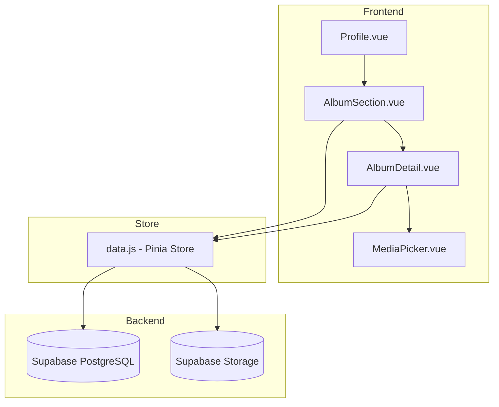

# Design Document: Profile Album

## Overview

Profile Album เป็นระบบจัดเก็บรูปภาพและเอกสารส่วนตัวสำหรับผู้ใช้ในระบบ Sports Club Management โดยเฉพาะนักกีฬาที่ต้องการเก็บรูปภาพจากการแข่งขัน เอกสารสำคัญ และหลักฐานต่างๆ ระบบนี้ใช้ Supabase Storage สำหรับจัดเก็บไฟล์ และ PostgreSQL สำหรับจัดการ metadata

## Architecture



## Components and Interfaces

### Vue Components

#### 1. AlbumSection.vue
- แสดงรายการอัลบั้มของผู้ใช้ในหน้า Profile
- ปุ่มสร้างอัลบั้มใหม่
- แสดง thumbnail ของอัลบั้มแต่ละรายการ

#### 2. AlbumDetail.vue
- แสดงรูปภาพทั้งหมดในอัลบั้ม (Grid Layout)
- ปุ่มอัปโหลดรูปภาพ/เอกสาร
- Preview รูปภาพขนาดเต็ม
- ลบรูปภาพ/อัลบั้ม

#### 3. MediaPicker.vue
- Component สำหรับเลือกรูปภาพจากอัลบั้ม
- ใช้ในฟอร์มสมัครแข่งขัน
- รองรับ single/multiple selection

### Store Functions (data.js)

```javascript
// Album Management
fetchUserAlbums(userId)
createAlbum(albumData)
updateAlbum(albumId, albumData)
deleteAlbum(albumId)

// Media Management
fetchAlbumMedia(albumId)
uploadMedia(albumId, file)
deleteMedia(mediaId)

// Storage Stats
getUserStorageStats(userId)
```

## Data Models

### Database Schema

#### Table: user_albums
```sql
CREATE TABLE user_albums (
  id UUID PRIMARY KEY DEFAULT gen_random_uuid(),
  user_id UUID NOT NULL REFERENCES auth.users(id) ON DELETE CASCADE,
  name VARCHAR(100) NOT NULL,
  description TEXT,
  album_type VARCHAR(50) DEFAULT 'general', -- competition, training, documents, general
  cover_image_url TEXT,
  created_at TIMESTAMPTZ DEFAULT NOW(),
  updated_at TIMESTAMPTZ DEFAULT NOW()
);

CREATE INDEX idx_user_albums_user_id ON user_albums(user_id);
CREATE INDEX idx_user_albums_type ON user_albums(album_type);
```

#### Table: album_media
```sql
CREATE TABLE album_media (
  id UUID PRIMARY KEY DEFAULT gen_random_uuid(),
  album_id UUID NOT NULL REFERENCES user_albums(id) ON DELETE CASCADE,
  user_id UUID NOT NULL REFERENCES auth.users(id) ON DELETE CASCADE,
  file_url TEXT NOT NULL,
  file_name VARCHAR(255) NOT NULL,
  file_type VARCHAR(50) NOT NULL, -- image/jpeg, image/png, application/pdf
  file_size INTEGER NOT NULL, -- bytes
  thumbnail_url TEXT,
  uploaded_at TIMESTAMPTZ DEFAULT NOW()
);

CREATE INDEX idx_album_media_album_id ON album_media(album_id);
CREATE INDEX idx_album_media_user_id ON album_media(user_id);
```

### RLS Policies

```sql
-- user_albums policies
ALTER TABLE user_albums ENABLE ROW LEVEL SECURITY;

-- Users can view their own albums
CREATE POLICY "Users can view own albums" ON user_albums
  FOR SELECT USING (auth.uid() = user_id);

-- Coaches can view their athletes' albums
CREATE POLICY "Coaches can view athlete albums" ON user_albums
  FOR SELECT USING (
    EXISTS (
      SELECT 1 FROM athletes a
      JOIN coaches c ON a.coach_id = c.id
      WHERE a.user_id = user_albums.user_id
      AND c.user_id = auth.uid()
    )
  );

-- Users can insert their own albums
CREATE POLICY "Users can create own albums" ON user_albums
  FOR INSERT WITH CHECK (auth.uid() = user_id);

-- Users can update their own albums
CREATE POLICY "Users can update own albums" ON user_albums
  FOR UPDATE USING (auth.uid() = user_id);

-- Users can delete their own albums
CREATE POLICY "Users can delete own albums" ON user_albums
  FOR DELETE USING (auth.uid() = user_id);

-- album_media policies
ALTER TABLE album_media ENABLE ROW LEVEL SECURITY;

-- Similar policies for album_media...
```

### Supabase Storage Bucket

```
Bucket: profile-albums
Structure:
  /{user_id}/
    /{album_id}/
      {filename}
```

## Correctness Properties

*A property is a characteristic or behavior that should hold true across all valid executions of a system-essentially, a formal statement about what the system should do. Properties serve as the bridge between human-readable specifications and machine-verifiable correctness guarantees.*

### Property 1: Album creation requires valid name and stores complete data
*For any* album creation request, if the name is non-empty and non-whitespace, the system should create an album with user_id, name, description, album_type, and created_at timestamp. If the name is empty or whitespace-only, creation should fail with validation error.
**Validates: Requirements 1.2, 1.3, 1.5**

### Property 2: Albums are sorted by most recently updated
*For any* list of albums returned for a user, the albums should be sorted in descending order by updated_at timestamp.
**Validates: Requirements 1.4**

### Property 3: File upload validation accepts only allowed types and sizes
*For any* file upload attempt, the system should accept files with MIME types (image/jpeg, image/png, image/webp, application/pdf) and size <= 10MB. Files with other types or larger sizes should be rejected with appropriate error.
**Validates: Requirements 2.2, 2.3**

### Property 4: Uploaded media creates correct storage path and database record
*For any* successfully uploaded file, the storage path should follow pattern `{user_id}/{album_id}/{filename}` and a media record should exist with album_id, file_url, file_name, file_type, file_size, and uploaded_at.
**Validates: Requirements 2.4, 2.5**

### Property 5: Media deletion removes both storage file and database record
*For any* media item deletion, after the operation completes, the file should not exist in storage and no database record should exist for that media_id.
**Validates: Requirements 3.3**

### Property 6: Album deletion cascades to all associated media
*For any* album deletion, after the operation completes, all media items that belonged to that album should also be deleted from both storage and database.
**Validates: Requirements 3.4**

### Property 7: Media picker returns valid file URL
*For any* media item selected through the media picker, the returned value should be a valid URL string that points to the file in storage.
**Validates: Requirements 4.3**

### Property 8: Album filtering returns only matching types
*For any* album filter by type (competition, training, documents), the returned albums should all have album_type matching the filter value.
**Validates: Requirements 4.4**

### Property 9: Coach access control for athlete albums
*For any* coach viewing an athlete's albums, the coach should be able to read albums of athletes in their club, but should not be able to create, update, or delete those albums or media items.
**Validates: Requirements 5.1, 5.3**

### Property 10: Storage quota enforcement
*For any* user with total storage usage >= 100MB, new upload attempts should be rejected with quota exceeded error.
**Validates: Requirements 6.2**

### Property 11: Storage statistics accuracy
*For any* user, the displayed storage statistics (total files count, total storage used) should match the actual sum of file_size from album_media records for that user.
**Validates: Requirements 6.3**

## Error Handling

### Upload Errors
- File too large: แสดงข้อความ "ไฟล์ต้องไม่เกิน 10MB"
- Invalid file type: แสดงข้อความ "รองรับเฉพาะไฟล์ JPG, PNG, WebP หรือ PDF"
- Storage quota exceeded: แสดงข้อความ "พื้นที่เก็บข้อมูลเต็ม กรุณาลบไฟล์เก่าก่อน"
- Network error: แสดงข้อความ "เกิดข้อผิดพลาด กรุณาลองใหม่"

### Permission Errors
- Unauthorized access: Redirect to login
- Forbidden (coach trying to edit): แสดงข้อความ "คุณไม่มีสิทธิ์แก้ไขข้อมูลนี้"

## Testing Strategy

### Unit Tests
- Album CRUD operations
- File validation functions
- Storage path generation
- Statistics calculation

### Property-Based Tests
ใช้ **fast-check** library สำหรับ property-based testing

- Property 1: Album creation validation and data completeness
- Property 2: Album sorting by updated_at
- Property 3: File type and size validation
- Property 4: Upload creates correct path and record
- Property 5: Media deletion consistency
- Property 6: Album cascade deletion
- Property 7: Media picker URL validity
- Property 8: Album type filtering
- Property 9: Coach access control
- Property 10: Storage quota enforcement
- Property 11: Storage statistics accuracy

### Integration Tests
- Full upload flow (select file → upload → verify in storage and DB)
- Album creation and media management flow
- Coach viewing athlete albums

### Test Configuration
- Property tests should run minimum 100 iterations
- Each property test must be tagged with format: `**Feature: profile-album, Property {number}: {property_text}**`
