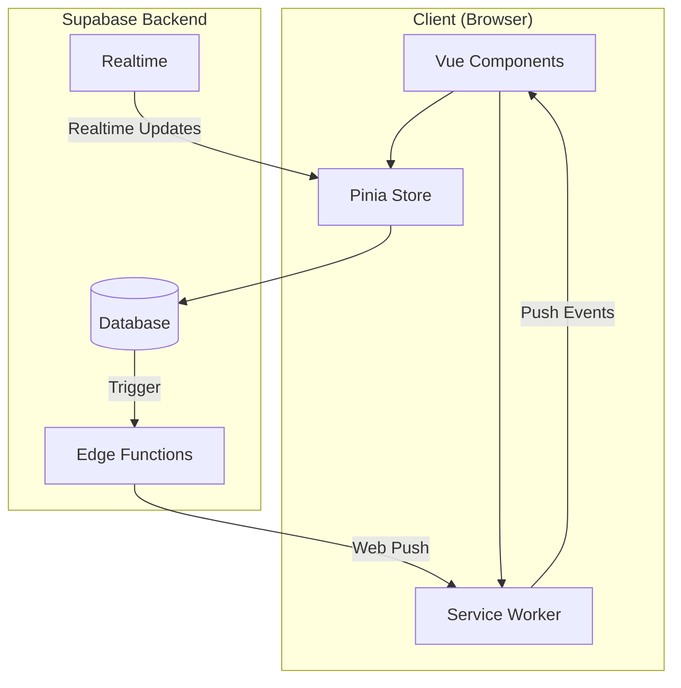

# Design Document: PWA Push Notifications

## Overview

ระบบ PWA Push Notifications สำหรับแอปจัดการสโมสรกีฬา ใช้ Web Push API และ Service Worker เพื่อส่งการแจ้งเตือนไปยังอุปกรณ์ผู้ใช้โดยตรง รองรับการตั้งค่าเปิด/ปิดการแจ้งเตือนแต่ละประเภท และทำงานร่วมกับ Supabase Edge Functions สำหรับการส่ง push notifications

## Architecture



### Data Flow

1. **Subscription Flow**: User grants permission → Browser generates subscription → Store in database
2. **Notification Flow**: Event occurs → Database trigger → Edge Function → Web Push API → Service Worker → Display notification
3. **Preference Flow**: User changes settings → Update database → Filter future notifications

## Components and Interfaces

### 1. Push Notification Service (`src/lib/pushNotification.js`)

```javascript
// Core functions for push notification management
export async function requestPermission(): Promise<NotificationPermission>
export async function subscribeToPush(userId: string): Promise<PushSubscription>
export async function unsubscribeFromPush(userId: string): Promise<boolean>
export function isPushSupported(): boolean
export function getPermissionStatus(): NotificationPermission
```

### 2. Notification Preferences Store (`src/stores/notificationPreferences.js`)

```javascript
// Pinia store for managing notification preferences
state: {
  preferences: NotificationPreferences,
  subscriptions: PushSubscription[],
  loading: boolean
}

actions: {
  fetchPreferences(userId: string): Promise<void>
  updatePreference(type: string, enabled: boolean): Promise<void>
  fetchSubscriptions(userId: string): Promise<void>
}
```

### 3. Notification Settings Component (`src/components/NotificationSettings.vue`)

- Display all notification types with toggle switches
- Show subscription status and device count
- Enable/disable push notifications globally
- Request permission button when not granted

### 4. Service Worker Push Handler (`sw.js` additions)

```javascript
// Handle push events
self.addEventListener('push', handlePushEvent)
self.addEventListener('notificationclick', handleNotificationClick)

function handlePushEvent(event): void
function handleNotificationClick(event): void
function groupNotifications(notifications: Notification[]): void
```

### 5. Supabase Edge Function (`supabase/functions/send-push/index.ts`)

```typescript
// Edge function to send push notifications
interface PushPayload {
  userId: string
  title: string
  message: string
  type: NotificationType
  referenceType?: string
  referenceId?: string
  url?: string
}

async function sendPush(payload: PushPayload): Promise<void>
async function getActiveSubscriptions(userId: string): Promise<Subscription[]>
async function filterByPreferences(userId: string, type: string): Promise<boolean>
```

## Data Models

### 1. push_subscriptions Table

```sql
CREATE TABLE push_subscriptions (
  id UUID PRIMARY KEY DEFAULT gen_random_uuid(),
  user_id UUID REFERENCES auth.users(id) ON DELETE CASCADE,
  endpoint TEXT NOT NULL,
  p256dh TEXT NOT NULL,
  auth TEXT NOT NULL,
  device_info JSONB,
  created_at TIMESTAMPTZ DEFAULT now(),
  last_used_at TIMESTAMPTZ DEFAULT now(),
  UNIQUE(user_id, endpoint)
);
```

### 2. notification_preferences Table

```sql
CREATE TABLE notification_preferences (
  id UUID PRIMARY KEY DEFAULT gen_random_uuid(),
  user_id UUID REFERENCES auth.users(id) ON DELETE CASCADE UNIQUE,
  push_enabled BOOLEAN DEFAULT true,
  announcement_urgent BOOLEAN DEFAULT true,
  announcement_normal BOOLEAN DEFAULT true,
  schedule_updates BOOLEAN DEFAULT true,
  event_reminders BOOLEAN DEFAULT true,
  tournament_updates BOOLEAN DEFAULT true,
  club_application BOOLEAN DEFAULT true,
  created_at TIMESTAMPTZ DEFAULT now(),
  updated_at TIMESTAMPTZ DEFAULT now()
);
```

### 3. NotificationPreferences Interface

```typescript
interface NotificationPreferences {
  id: string
  user_id: string
  push_enabled: boolean
  announcement_urgent: boolean
  announcement_normal: boolean
  schedule_updates: boolean
  event_reminders: boolean
  tournament_updates: boolean
  club_application: boolean
}
```

### 4. PushSubscription Interface

```typescript
interface PushSubscriptionRecord {
  id: string
  user_id: string
  endpoint: string
  p256dh: string
  auth: string
  device_info: {
    userAgent: string
    platform: string
  }
  created_at: string
  last_used_at: string
}
```

## Correctness Properties

*A property is a characteristic or behavior that should hold true across all valid executions of a system-essentially, a formal statement about what the system should do. Properties serve as the bridge between human-readable specifications and machine-verifiable correctness guarantees.*

### Property 1: Subscription persistence round-trip
*For any* valid push subscription data, storing it in the database and then retrieving it should return equivalent subscription data (endpoint, p256dh, auth keys match).
**Validates: Requirements 1.1**

### Property 2: Notification delivery to all subscribed devices
*For any* notification event and any user with N active subscriptions, the system should attempt to send exactly N push notifications (one per subscription).
**Validates: Requirements 1.3**

### Property 3: Notification display format completeness
*For any* push notification payload containing title and message, the displayed notification should include both the title and message fields.
**Validates: Requirements 1.4**

### Property 4: Preference filtering correctness
*For any* notification type and user preference setting, if the preference for that type is disabled, no push notification of that type should be sent to that user; if enabled, the notification should be sent.
**Validates: Requirements 2.2, 2.3**

### Property 5: Preference persistence round-trip
*For any* notification preference change, saving to the database and then fetching should return the updated preference value.
**Validates: Requirements 2.4**

### Property 6: Target type filtering correctness
*For any* announcement with a specific target_type, push notifications should only be sent to users matching that target criteria:
- "all" → all users with enabled preferences
- "club" → only users in the specified club
- "coaches" → only users with coach role
- "athletes" → only users with athlete role
**Validates: Requirements 5.1, 5.2, 5.3, 5.4**

### Property 7: Status change notification delivery
*For any* status change (tournament registration or club application), the affected user should receive exactly one push notification about the change.
**Validates: Requirements 3.4, 3.5**

### Property 8: Logout subscription cleanup
*For any* user logout action, all push subscriptions for that device should be removed from the database.
**Validates: Requirements 4.2**

### Property 9: Invalid subscription cleanup
*For any* push subscription that returns an error (410 Gone or similar), the subscription should be removed from the database.
**Validates: Requirements 4.4**

### Property 10: Notification click navigation
*For any* push notification with a reference_type and reference_id, clicking the notification should navigate to the corresponding URL path.
**Validates: Requirements 6.3**

## Error Handling

### Permission Denied
- Display friendly message explaining benefits of notifications
- Store preference to not ask again (respect user choice)
- Provide manual enable option in settings

### Subscription Failed
- Retry with exponential backoff (max 3 attempts)
- Log error for debugging
- Show user-friendly error message

### Push Send Failed
- Handle 410 Gone (subscription expired) → remove subscription
- Handle 429 Too Many Requests → implement rate limiting
- Queue failed notifications for retry

### Offline Handling
- Service Worker caches notification data
- Display notifications when back online
- Sync subscription status on reconnect

## Testing Strategy

### Property-Based Testing Library
**fast-check** จะถูกใช้สำหรับ property-based testing ใน JavaScript/TypeScript

### Unit Tests
- Test subscription creation and storage
- Test preference CRUD operations
- Test notification filtering logic
- Test URL generation for notification clicks

### Property-Based Tests
Each correctness property will be implemented as a property-based test using fast-check:

1. **Property 1 Test**: Generate random subscription data, store and retrieve, verify equality
2. **Property 4 Test**: Generate random preferences and notification types, verify filtering
3. **Property 5 Test**: Generate random preference changes, verify round-trip
4. **Property 6 Test**: Generate random announcements with target types, verify recipient filtering
5. **Property 10 Test**: Generate random notification references, verify URL generation

### Test Configuration
- Minimum 100 iterations per property test
- Each test tagged with: `**Feature: pwa-push-notifications, Property {number}: {property_text}**`

### Integration Tests
- Test full flow: permission → subscribe → receive notification
- Test preference changes affect notification delivery
- Test logout removes subscriptions
