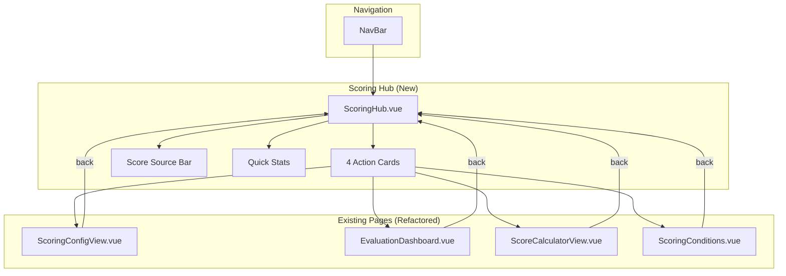

# Design Document: Scoring Hub Consolidation

## Overview

ระบบ Scoring Hub ออกแบบให้โค้ช **เข้าใจได้ภายใน 3 วินาที** โดยรวมทุกฟีเจอร์เกี่ยวกับคะแนนไว้ในหน้าเดียว ใช้หลักการ Minimal UI และ Big Clear Cards

### Key Design Goals

1. **3-Second Rule** - เห็นปุ๊บรู้ปั๊บว่าทำอะไรได้
2. **4 Cards Only** - ไม่เกิน 4 ตัวเลือกหลัก
3. **Single Entry Point** - เมนูเดียว "ศูนย์คะแนน"
4. **Zero Learning Curve** - ใช้ได้ทันทีไม่ต้องเรียนรู้

## Architecture



## Components and Interfaces

### 1. ScoringHub.vue (Main Component)

```typescript
interface ScoringHubState {
  configStatus: 'active' | 'inactive' | 'none';
  actionCards: ActionCard[];
  scoreSources: ScoreSource[];
  quickStats: QuickStats | null;
}

interface ActionCard {
  id: string;
  icon: string;           // SVG icon name
  title: string;          // Max 4 words
  route: string;          // Navigation target
  status: 'active' | 'inactive' | 'setup';
  showBadge: boolean;     // Show "ตั้งค่า" badge
}

interface ScoreSource {
  category: string;       // attendance, training, skill, competition, bonus
  displayName: string;    // Thai name
  weight: number;         // 0-100
  color: string;          // Hex color for bar segment
}

interface QuickStats {
  totalAthletes: number;
  averageScore: number;
  excellentCount: number;
  needsImprovementCount: number;
}
```

### 2. ActionCard.vue Component

```typescript
interface ActionCardProps {
  icon: string;
  title: string;
  status: 'active' | 'inactive' | 'setup';
  showBadge: boolean;
  to: string;
}

// Card dimensions
const CARD_MIN_SIZE = {
  width: '140px',
  height: '120px',
  iconSize: '48px',
  touchTarget: '48px'
}
```

### 3. ScoreSourceBar.vue Component

```typescript
interface ScoreSourceBarProps {
  sources: ScoreSource[];
  maxSegments: 5;         // Always max 5
  onSegmentClick: (category: string) => void;
}
```

### 4. StatusBanner.vue Component

```typescript
interface StatusBannerProps {
  status: 'active' | 'inactive' | 'none';
  onAction: () => void;   // Single action button
}

// Banner text (max 1 line)
const BANNER_TEXT = {
  active: '✓ พร้อมใช้งาน',
  inactive: '⚠ ยังไม่เปิดใช้งาน',
  none: 'เริ่มต้นใช้งาน'
}

const BANNER_ACTION = {
  active: null,           // No action needed
  inactive: 'เปิดใช้งาน',
  none: 'ตั้งค่าเลย'
}
```

## Data Models

### Hub Configuration (Computed from existing data)

```typescript
// ไม่ต้องสร้างตารางใหม่ - ใช้ข้อมูลจาก club_scoring_configs
interface HubConfig {
  hasConfig: boolean;
  isActive: boolean;
  categories: {
    name: string;
    weight: number;
  }[];
  lastUpdated: Date | null;
}
```

### Fixed Action Cards

```javascript
// 4 การ์ดคงที่ - ไม่เปลี่ยนแปลง
const ACTION_CARDS = [
  {
    id: 'config',
    icon: 'settings',
    title: 'ตั้งค่าเกณฑ์',
    route: '/scoring-config'
  },
  {
    id: 'evaluation',
    icon: 'chart',
    title: 'ดูผลประเมิน',
    route: '/evaluation'
  },
  {
    id: 'calculator',
    icon: 'calculator',
    title: 'คำนวณคะแนน',
    route: '/score-calculator'
  },
  {
    id: 'conditions',
    icon: 'plus-minus',
    title: 'โบนัส/หักคะแนน',
    route: '/scoring-conditions'
  }
]
```

### Score Source Colors

```javascript
const SOURCE_COLORS = {
  attendance: '#3B82F6',   // Blue
  training: '#10B981',     // Green
  skill: '#F59E0B',        // Amber
  competition: '#EF4444',  // Red
  bonus: '#8B5CF6'         // Purple
}
```

## Correctness Properties

*A property is a characteristic or behavior that should hold true across all valid executions of a system-essentially, a formal statement about what the system should do. Properties serve as the bridge between human-readable specifications and machine-verifiable correctness guarantees.*

### Property 1: Fixed Card Count
*For any* hub state (with or without configuration), the hub SHALL always display exactly 4 Action Cards.
**Validates: Requirements 2.1, 8.4**

### Property 2: Title Length Constraint
*For any* Action Card title, the title SHALL contain maximum 4 words.
**Validates: Requirements 1.2**

### Property 3: Status Banner Correctness
*For any* active configuration, the status banner SHALL display green color and "พร้อมใช้งาน" text. *For any* inactive configuration, the banner SHALL display yellow color.
**Validates: Requirements 4.1, 4.2**

### Property 4: Score Source Bar Segment Limit
*For any* scoring configuration with N categories, the Score Source Bar SHALL display minimum(N, 5) segments.
**Validates: Requirements 3.3**

### Property 5: Segment Display Completeness
*For any* segment in the Score Source Bar, the segment SHALL display both category name and weight percentage.
**Validates: Requirements 3.2**

### Property 6: Back Navigation Consistency
*For any* scoring sub-page, the back navigation SHALL always return to the hub route (/scoring-hub).
**Validates: Requirements 5.3**

### Property 7: Sub-page Back Arrow Presence
*For any* scoring sub-page (config, evaluation, calculator, conditions), the page SHALL display a back arrow in the header.
**Validates: Requirements 5.2**

### Property 8: Empty Stats Hiding
*For any* state where athlete count is zero, the quick stats section SHALL not be rendered.
**Validates: Requirements 6.4**

### Property 9: Setup Badge Logic
*For any* Action Card representing incomplete setup, the card SHALL display a badge. *For any* complete setup, no badge SHALL be shown.
**Validates: Requirements 2.4**

### Property 10: Sport Type Selection Limit
*For any* first-time setup flow, the sport type selection SHALL display maximum 5 options.
**Validates: Requirements 7.2**

## Error Handling

| Scenario | Behavior |
|----------|----------|
| No configuration | Show setup flow (2 steps) |
| Config load error | Show retry button |
| Stats load error | Hide stats section |
| Navigation error | Fallback to hub |

## Testing Strategy

### Property-Based Testing Library

ใช้ **fast-check** สำหรับ property-based testing

### Test Categories

1. **Card Tests**
   - Property 1: Fixed card count
   - Property 2: Title length
   - Property 9: Badge logic

2. **Status Tests**
   - Property 3: Banner correctness

3. **Bar Tests**
   - Property 4: Segment limit
   - Property 5: Segment display

4. **Navigation Tests**
   - Property 6: Back navigation
   - Property 7: Back arrow presence

5. **Stats Tests**
   - Property 8: Empty stats hiding

6. **Setup Tests**
   - Property 10: Sport type limit

