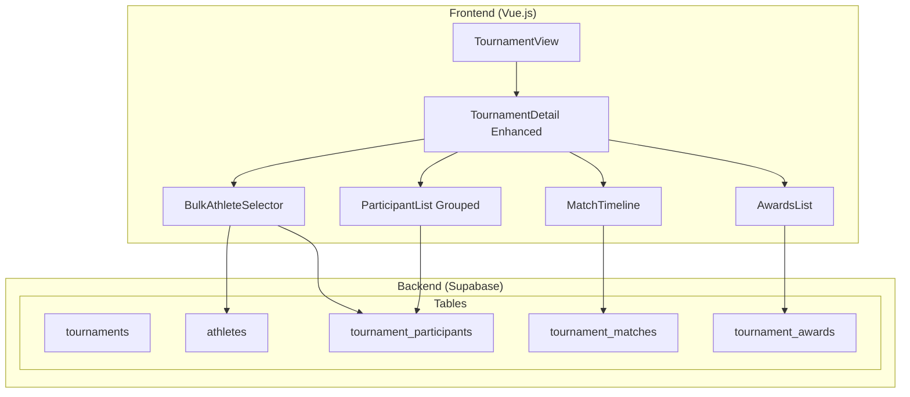

# Design Document: Tournament Management Enhancement

## Overview

ระบบจัดการทัวนาเมนต์ที่ปรับปรุงใหม่ เพื่อให้การจัดการนักกีฬาและข้อมูลทัวนาเมนต์สะดวก รวดเร็ว และใช้งานง่ายขึ้น โดยเน้นการเพิ่มนักกีฬาแบบ Bulk และ UI ที่จัดเป็นหมวดหมู่

### Key Design Goals

1. **Efficiency** - เพิ่มนักกีฬาได้ครั้งละหลายคน ลดเวลาการทำงาน
2. **Organization** - จัดระเบียบข้อมูลเป็นหมวดหมู่ที่ชัดเจน
3. **Usability** - UI ที่ใช้งานง่าย รองรับทั้ง Desktop และ Mobile
4. **Quick Actions** - การดำเนินการที่รวดเร็วด้วย Bulk Operations

## Architecture



## Components and Interfaces

### 1. Bulk Athlete Selector Component

Component สำหรับเลือกนักกีฬาหลายคนพร้อมกัน

```typescript
interface BulkAthleteSelector {
  // Props
  tournamentId: string;
  existingParticipantIds: string[];  // นักกีฬาที่ลงทะเบียนแล้ว
  
  // State
  athletes: Athlete[];
  selectedAthletes: Set<string>;
  searchQuery: string;
  filterClubId: string | null;
  
  // Computed
  groupedAthletes: Map<string, Athlete[]>;  // grouped by club
  filteredAthletes: Athlete[];
  selectedCount: number;
}

interface BulkAddPayload {
  tournamentId: string;
  athleteIds: string[];
  category: string | null;
  weightClass: string | null;
}

interface BulkAddResult {
  success: boolean;
  addedCount: number;
  failedCount: number;
  failures: { athleteId: string; error: string }[];
}
```

### 2. Grouped Participant List Component

Component แสดงรายชื่อผู้เข้าแข่งขันแบบจัดกลุ่ม

```typescript
interface GroupedParticipantList {
  // Props
  participants: Participant[];
  
  // State
  expandedCategories: Set<string>;
  selectedParticipants: Set<string>;
  
  // Computed
  groupedByCategory: Map<string, Participant[]>;
  categoryStats: CategoryStat[];
  totalCount: number;
}

interface CategoryStat {
  category: string;
  displayName: string;
  count: number;
  participants: Participant[];
}

interface Participant {
  id: string;
  athlete_id: string;
  athletes: {
    id: string;
    name: string;
    club_id: string;
    clubs: { name: string };
  };
  category: string | null;
  weight_class: string | null;
  registration_status: 'pending' | 'approved' | 'rejected' | 'withdrawn';
}
```

### 3. Match Timeline Component

Component แสดงผลการแข่งขันแบบ Timeline

```typescript
interface MatchTimeline {
  // Props
  matches: Match[];
  participants: Participant[];
  
  // Computed
  groupedByRound: Map<string, Match[]>;
  sortedRounds: string[];
}

interface Match {
  id: string;
  tournament_id: string;
  participant_id: string;
  match_date: string;
  match_time: string | null;
  round: string | null;
  opponent_name: string | null;
  opponent_club: string | null;
  result: 'win' | 'lose' | 'draw' | 'pending';
  score: string | null;
  notes: string | null;
}
```

### 4. Registration Statistics Component

```typescript
interface RegistrationStats {
  totalRegistered: number;
  maxParticipants: number | null;
  remainingSlots: number | null;
  byStatus: {
    pending: number;
    approved: number;
    rejected: number;
    withdrawn: number;
  };
  byCategory: Map<string, number>;
}
```

## Data Models

### Enhanced Store Actions

```typescript
// stores/tournament.js - เพิ่ม actions ใหม่

interface TournamentStore {
  // Existing
  tournaments: Tournament[];
  
  // New Actions
  bulkAddParticipants(payload: BulkAddPayload): Promise<BulkAddResult>;
  bulkRemoveParticipants(participantIds: string[]): Promise<{ success: boolean; removedCount: number }>;
  bulkUpdateCategory(participantIds: string[], category: string): Promise<{ success: boolean; updatedCount: number }>;
  
  // New Getters
  getParticipantsGroupedByCategory(tournamentId: string): Map<string, Participant[]>;
  getMatchesGroupedByRound(tournamentId: string): Map<string, Match[]>;
  getRegistrationStats(tournamentId: string): RegistrationStats;
}
```

### Utility Functions

```typescript
// lib/tournamentUtils.js

// จัดกลุ่มนักกีฬาตามชมรม
function groupAthletesByClub(athletes: Athlete[]): Map<string, Athlete[]>;

// จัดกลุ่มผู้เข้าแข่งขันตามรุ่น
function groupParticipantsByCategory(participants: Participant[]): Map<string, Participant[]>;

// เรียงลำดับผู้เข้าแข่งขันตาม weight_class แล้ว name
function sortParticipants(participants: Participant[]): Participant[];

// จัดกลุ่มการแข่งขันตามรอบ
function groupMatchesByRound(matches: Match[]): Map<string, Match[]>;

// เรียงลำดับการแข่งขันตามวันเวลา
function sortMatchesChronologically(matches: Match[]): Match[];

// คำนวณสถิติการลงทะเบียน
function calculateRegistrationStats(participants: Participant[], maxParticipants: number | null): RegistrationStats;

// กรองนักกีฬาตาม search query
function filterAthletesByName(athletes: Athlete[], query: string): Athlete[];
```

## Correctness Properties

*A property is a characteristic or behavior that should hold true across all valid executions of a system-essentially, a formal statement about what the system should do. Properties serve as the bridge between human-readable specifications and machine-verifiable correctness guarantees.*

### Property 1: Selection Count Accuracy
*For any* set of selected athletes in the bulk selector, the displayed count SHALL equal the actual size of the selection set.
**Validates: Requirements 1.2**

### Property 2: Bulk Add Completeness
*For any* list of selected athletes for bulk add, after the operation completes, all successfully added athletes SHALL have corresponding participant records in the tournament.
**Validates: Requirements 1.3**

### Property 3: Partial Failure Handling
*For any* bulk add operation where some athletes fail, the successful athletes SHALL still be added and the failure count SHALL equal the number of athletes that failed.
**Validates: Requirements 1.5**

### Property 4: Club Grouping Correctness
*For any* list of athletes, when grouped by club, each athlete SHALL appear in exactly one group matching their club_id.
**Validates: Requirements 2.1**

### Property 5: Search Filter Correctness
*For any* search query, all athletes in the filtered result SHALL have names containing the query string (case-insensitive).
**Validates: Requirements 2.2**

### Property 6: Select All Correctness
*For any* filtered athlete list, after select all operation, the selection count SHALL equal the count of visible filtered athletes.
**Validates: Requirements 2.3**

### Property 7: Registered Athletes Exclusion
*For any* athlete already registered in the tournament, they SHALL be marked as disabled in the selection interface.
**Validates: Requirements 2.4**

### Property 8: Category Grouping Correctness
*For any* list of participants, when grouped by category, each participant SHALL appear in exactly one group (including Uncategorized for null/empty category).
**Validates: Requirements 3.1, 3.4**

### Property 9: Participant Sorting Correctness
*For any* category group, participants SHALL be sorted by weight_class first, then by name alphabetically.
**Validates: Requirements 3.2**

### Property 10: Category Count Consistency
*For any* grouped participant list, the sum of all category counts SHALL equal the total participant count.
**Validates: Requirements 3.3**

### Property 11: Bulk Remove Completeness
*For any* selection of participants for bulk remove, after the operation completes, none of the selected participants SHALL exist in the participant list.
**Validates: Requirements 4.3**

### Property 12: Bulk Category Update Consistency
*For any* selection of participants and a new category value, after bulk update, all selected participants SHALL have the new category value.
**Validates: Requirements 4.4**

### Property 13: Match Round Grouping Correctness
*For any* list of matches, when grouped by round, each match SHALL appear in exactly one round group.
**Validates: Requirements 5.4, 7.1**

### Property 14: Match Chronological Sorting
*For any* round group, matches SHALL be sorted by match_date and match_time in ascending order.
**Validates: Requirements 7.2**

### Property 15: Statistics Count Accuracy
*For any* participant list, the total count SHALL equal the sum of status breakdown counts.
**Validates: Requirements 6.1, 6.2**

### Property 16: Remaining Slots Calculation
*For any* tournament with max_participants set, remaining slots SHALL equal max_participants minus current participant count.
**Validates: Requirements 6.4**

## Error Handling

### Validation Errors

| Error Code | Condition | Message |
|------------|-----------|---------|
| NO_ATHLETES_SELECTED | Selection is empty | "กรุณาเลือกนักกีฬาอย่างน้อย 1 คน" |
| ATHLETE_ALREADY_REGISTERED | Athlete already in tournament | "นักกีฬา {name} ลงทะเบียนแล้ว" |
| MAX_PARTICIPANTS_EXCEEDED | Would exceed max limit | "เกินจำนวนผู้เข้าแข่งขันสูงสุด (เหลือ {remaining} ที่)" |
| REGISTRATION_CLOSED | Past deadline | "หมดเขตรับสมัครแล้ว" |

### Bulk Operation Errors

| Error Code | Condition | Message |
|------------|-----------|---------|
| PARTIAL_FAILURE | Some items failed | "เพิ่มสำเร็จ {success} คน, ล้มเหลว {failed} คน" |
| ALL_FAILED | All items failed | "ไม่สามารถเพิ่มนักกีฬาได้ กรุณาลองใหม่" |
| NO_SELECTION | No items selected for bulk action | "กรุณาเลือกรายการที่ต้องการดำเนินการ" |

## Testing Strategy

### Dual Testing Approach

ใช้ทั้ง Unit Tests และ Property-Based Tests:

1. **Unit Tests** - ทดสอบ specific examples และ edge cases
2. **Property-Based Tests** - ทดสอบ universal properties ด้วย random inputs

### Property-Based Testing Library

ใช้ **fast-check** สำหรับ TypeScript/JavaScript property-based testing

```bash
npm install --save-dev fast-check
```

### Test Configuration

- Minimum iterations per property: 100
- Each property test must reference the correctness property from design document
- Format: `**Feature: tournament-management-enhancement, Property {number}: {property_text}**`

### Test Categories

1. **Selection Tests**
   - Property 1: Selection count accuracy
   - Property 6: Select all correctness
   - Property 7: Registered athletes exclusion

2. **Bulk Operation Tests**
   - Property 2: Bulk add completeness
   - Property 3: Partial failure handling
   - Property 11: Bulk remove completeness
   - Property 12: Bulk category update consistency

3. **Grouping Tests**
   - Property 4: Club grouping correctness
   - Property 8: Category grouping correctness
   - Property 13: Match round grouping correctness

4. **Sorting Tests**
   - Property 9: Participant sorting correctness
   - Property 14: Match chronological sorting

5. **Filter Tests**
   - Property 5: Search filter correctness

6. **Statistics Tests**
   - Property 10: Category count consistency
   - Property 15: Statistics count accuracy
   - Property 16: Remaining slots calculation

## Role Matrix

| การกระทำ | Admin | Coach | Athlete |
|----------|-------|-------|---------|
| ดูทัวนาเมนต์ทั้งหมด | ✅ | ✅ | ✅ |
| สร้างทัวนาเมนต์ | ✅ | ✅ | ❌ |
| แก้ไขทัวนาเมนต์ | ✅ | ✅ (เฉพาะที่สร้าง) | ❌ |
| ลบทัวนาเมนต์ | ✅ | ✅ (เฉพาะที่สร้าง) | ❌ |
| เพิ่มนักกีฬา (Bulk) | ✅ | ✅ (เฉพาะในชมรม) | ❌ |
| ลบนักกีฬา (Bulk) | ✅ | ✅ (เฉพาะในชมรม) | ❌ |
| บันทึกผลการแข่งขัน | ✅ | ✅ (เฉพาะในชมรม) | ❌ |
| เพิ่มรางวัล | ✅ | ✅ (เฉพาะในชมรม) | ❌ |

