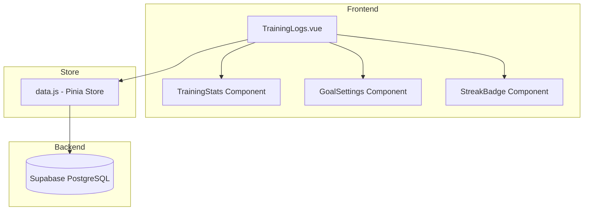

# Design Document: Training Logs Enhancement

## Overview

Training Logs Enhancement เป็นการต่อยอดระบบบันทึกการฝึกซ้อมที่มีอยู่ โดยเพิ่มความสามารถในการจัดหมวดหมู่กิจกรรม, แสดงสถิติและกราฟความก้าวหน้า, ตั้งเป้าหมายการฝึก, และระบบ Streak/Achievement ระบบนี้ใช้ Supabase PostgreSQL สำหรับจัดเก็บข้อมูลและ Vue.js สำหรับ UI

## Architecture



## Components and Interfaces

### Vue Components

#### 1. TrainingLogs.vue (Enhanced)
- เพิ่ม dropdown เลือกหมวดหมู่กิจกรรม
- เพิ่มตัวกรองตามหมวดหมู่
- แสดง category badge บนแต่ละ log

#### 2. TrainingStats Component (Inline)
- แสดงสถิติสรุป: จำนวนครั้ง, ชั่วโมงรวม, คะแนนเฉลี่ย
- แสดงกราฟรายสัปดาห์ (simple bar chart)
- แสดงการกระจายตามหมวดหมู่
- เปรียบเทียบสัปดาห์นี้กับสัปดาห์ก่อน

#### 3. GoalSettings Component (Inline)
- ตั้งเป้าหมายจำนวนครั้งต่อสัปดาห์
- แสดง progress bar ความคืบหน้า

#### 4. StreakBadge Component (Inline)
- แสดงจำนวนวันฝึกต่อเนื่อง
- แสดง achievement badges ที่ได้รับ

### Store Functions (data.js)

```javascript
// Activity Categories
fetchActivityCategories()
addActivityCategory(categoryData) // Admin only

// Training Statistics
getTrainingStats(userId, dateRange)
getWeeklyComparison(userId)
getCategoryDistribution(userId)

// Goals
fetchUserGoal(userId)
setUserGoal(userId, goalData)
getGoalProgress(userId)

// Streaks & Achievements
calculateStreak(userId)
fetchUserAchievements(userId)
checkAndAwardAchievements(userId)
```

## Data Models

### Database Schema

#### Table: activity_categories
```sql
CREATE TABLE activity_categories (
  id UUID PRIMARY KEY DEFAULT gen_random_uuid(),
  name VARCHAR(50) NOT NULL,
  icon VARCHAR(50),
  is_active BOOLEAN DEFAULT true,
  sort_order INTEGER DEFAULT 0,
  created_at TIMESTAMPTZ DEFAULT NOW()
);

-- Default categories
INSERT INTO activity_categories (name, icon, sort_order) VALUES
  ('วิ่ง', 'run', 1),
  ('ว่ายน้ำ', 'swim', 2),
  ('ยกน้ำหนัก', 'weight', 3),
  ('ยืดเหยียด', 'stretch', 4),
  ('กีฬาเฉพาะทาง', 'sport', 5),
  ('อื่นๆ', 'other', 99);
```

#### Alter Table: training_logs (add category)
```sql
ALTER TABLE training_logs 
ADD COLUMN category_id UUID REFERENCES activity_categories(id),
ADD COLUMN custom_activity VARCHAR(100);
```

#### Table: training_goals
```sql
CREATE TABLE training_goals (
  id UUID PRIMARY KEY DEFAULT gen_random_uuid(),
  user_id UUID NOT NULL REFERENCES auth.users(id) ON DELETE CASCADE,
  goal_type VARCHAR(50) DEFAULT 'weekly_sessions',
  target_value INTEGER NOT NULL DEFAULT 3,
  start_date DATE DEFAULT CURRENT_DATE,
  is_active BOOLEAN DEFAULT true,
  created_at TIMESTAMPTZ DEFAULT NOW(),
  updated_at TIMESTAMPTZ DEFAULT NOW(),
  UNIQUE(user_id, goal_type)
);

CREATE INDEX idx_training_goals_user_id ON training_goals(user_id);
```

#### Table: user_achievements
```sql
CREATE TABLE user_achievements (
  id UUID PRIMARY KEY DEFAULT gen_random_uuid(),
  user_id UUID NOT NULL REFERENCES auth.users(id) ON DELETE CASCADE,
  achievement_type VARCHAR(50) NOT NULL,
  earned_at TIMESTAMPTZ DEFAULT NOW(),
  UNIQUE(user_id, achievement_type)
);

CREATE INDEX idx_user_achievements_user_id ON user_achievements(user_id);
```

### RLS Policies

```sql
-- activity_categories: Everyone can read, Admin can manage
ALTER TABLE activity_categories ENABLE ROW LEVEL SECURITY;

CREATE POLICY "Everyone can view active categories" ON activity_categories
  FOR SELECT USING (is_active = true OR EXISTS (
    SELECT 1 FROM user_profiles WHERE id = auth.uid() AND role = 'admin'
  ));

CREATE POLICY "Admin can manage categories" ON activity_categories
  FOR ALL USING (
    EXISTS (SELECT 1 FROM user_profiles WHERE id = auth.uid() AND role = 'admin')
  );

-- training_goals: Users manage own, Coach can view athletes
ALTER TABLE training_goals ENABLE ROW LEVEL SECURITY;

CREATE POLICY "Users can manage own goals" ON training_goals
  FOR ALL USING (auth.uid() = user_id);

CREATE POLICY "Coach can view athlete goals" ON training_goals
  FOR SELECT USING (
    EXISTS (
      SELECT 1 FROM user_profiles coach
      JOIN user_profiles athlete ON athlete.id = training_goals.user_id
      WHERE coach.id = auth.uid()
      AND coach.role = 'coach'
      AND coach.club_id = athlete.club_id
    )
  );

-- user_achievements: Users view own, Coach can view athletes
ALTER TABLE user_achievements ENABLE ROW LEVEL SECURITY;

CREATE POLICY "Users can view own achievements" ON user_achievements
  FOR SELECT USING (auth.uid() = user_id);

CREATE POLICY "System can insert achievements" ON user_achievements
  FOR INSERT WITH CHECK (auth.uid() = user_id);

CREATE POLICY "Coach can view athlete achievements" ON user_achievements
  FOR SELECT USING (
    EXISTS (
      SELECT 1 FROM user_profiles coach
      JOIN user_profiles athlete ON athlete.id = user_achievements.user_id
      WHERE coach.id = auth.uid()
      AND coach.role = 'coach'
      AND coach.club_id = athlete.club_id
    )
  );
```

### Role Matrix

| การกระทำ | Admin | Coach | Athlete |
|----------|-------|-------|---------|
| ดูหมวดหมู่ทั้งหมด | ✅ | ✅ | ✅ |
| จัดการหมวดหมู่ | ✅ | ❌ | ❌ |
| ดูสถิติตัวเอง | ✅ | ✅ | ✅ |
| ดูสถิตินักกีฬาในชมรม | ✅ | ✅ | ❌ |
| ตั้งเป้าหมายตัวเอง | ✅ | ✅ | ✅ |
| ดู achievements ตัวเอง | ✅ | ✅ | ✅ |
| ดู achievements นักกีฬา | ✅ | ✅ | ❌ |

## Correctness Properties

*A property is a characteristic or behavior that should hold true across all valid executions of a system-essentially, a formal statement about what the system should do. Properties serve as the bridge between human-readable specifications and machine-verifiable correctness guarantees.*

### Property 1: Category filter returns only matching logs
*For any* set of training logs and any category filter, all returned logs should have category_id matching the filter value.
**Validates: Requirements 1.3**

### Property 2: Statistics calculation accuracy
*For any* set of training logs for a user, the calculated statistics (total sessions, total hours, average rating, category distribution) should match the actual sum/average of the underlying data.
**Validates: Requirements 2.1, 2.2, 2.3, 2.4**

### Property 3: Goal progress calculation
*For any* user with a weekly goal, the progress value should equal the count of training sessions in the current week, and completion indicator should show when progress >= target.
**Validates: Requirements 3.3, 3.4**

### Property 4: Streak calculation correctness
*For any* sequence of training log dates for a user, the streak counter should equal the number of consecutive days ending with today (or yesterday if no log today), and should reset to zero when there's a gap of more than one day.
**Validates: Requirements 4.1, 4.2**

### Property 5: Achievement milestone awards
*For any* user reaching streak milestones (7, 14, 30, 60, 90 days), an achievement record should exist with the correct achievement_type and earned_at timestamp.
**Validates: Requirements 4.4, 4.5**

### Property 6: Coach read-only access
*For any* coach accessing an athlete's training data, the coach should be able to read training logs, goals, and achievements, but database operations for INSERT, UPDATE, DELETE on athlete's data should be rejected.
**Validates: Requirements 5.2, 5.3**

### Property 7: Category deactivation preserves existing logs
*For any* category that is deactivated, existing training logs with that category should retain their category_id, but the category should not appear in the active categories list for new entries.
**Validates: Requirements 6.3**

## Error Handling

### Validation Errors
- Invalid goal value: แสดงข้อความ "เป้าหมายต้องเป็นตัวเลข 1-7"
- Missing category: ใช้ "อื่นๆ" เป็นค่าเริ่มต้น

### Permission Errors
- Coach trying to edit: แสดงข้อความ "คุณไม่มีสิทธิ์แก้ไขข้อมูลนี้"

### Edge Cases
- No training data: แสดงค่า 0 และข้อความ "ยังไม่มีข้อมูล"
- Streak broken: แสดง "เริ่มต้นใหม่วันนี้!"

## Testing Strategy

### Unit Tests
- Statistics calculation functions
- Streak calculation logic
- Goal progress calculation
- Category filtering

### Property-Based Tests
ใช้ **fast-check** library สำหรับ property-based testing

- Property 1: Category filter correctness
- Property 2: Statistics calculation accuracy
- Property 3: Goal progress calculation
- Property 4: Streak calculation correctness
- Property 5: Achievement milestone awards
- Property 6: Coach read-only access
- Property 7: Category deactivation behavior

### Test Configuration
- Property tests should run minimum 100 iterations
- Each property test must be tagged with format: `**Feature: training-logs-enhancement, Property {number}: {property_text}**`
